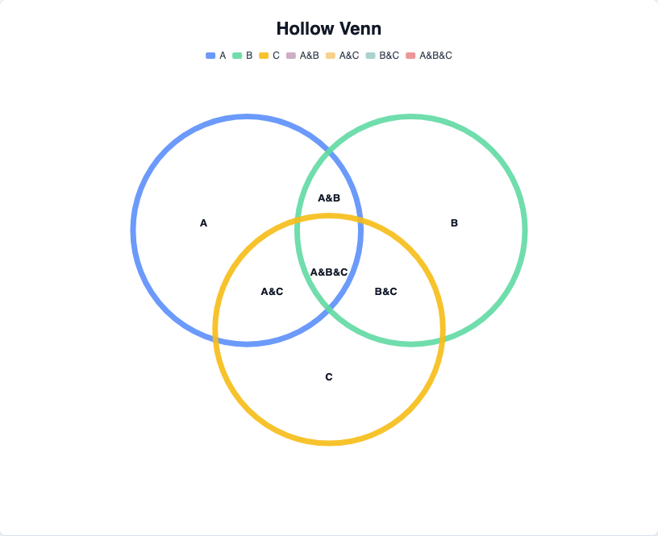
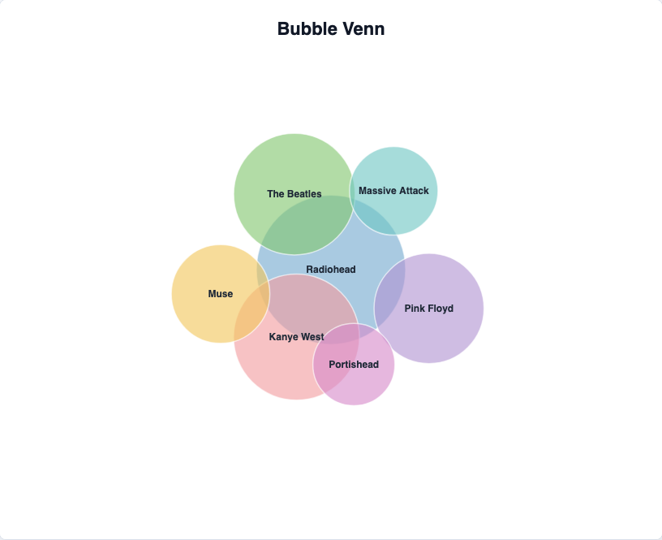
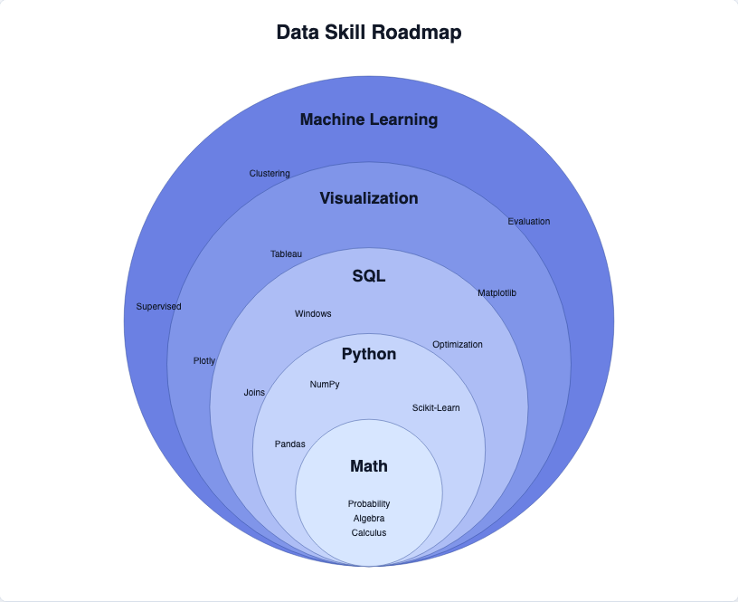
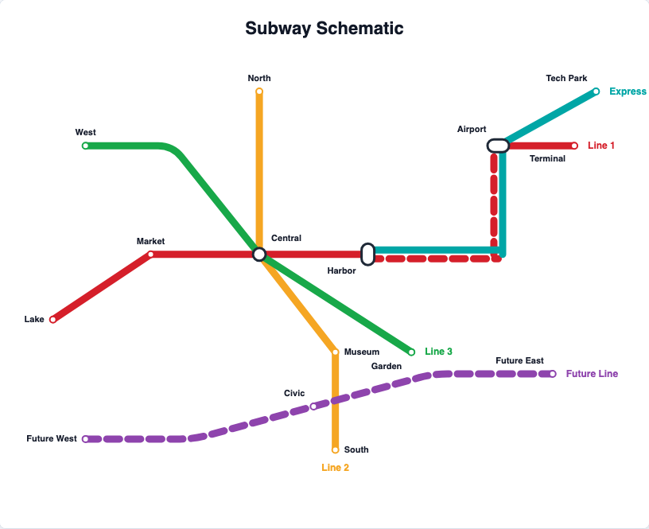
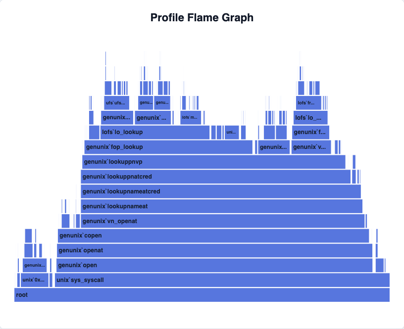
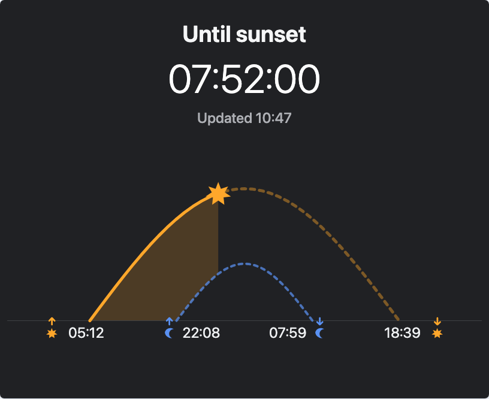
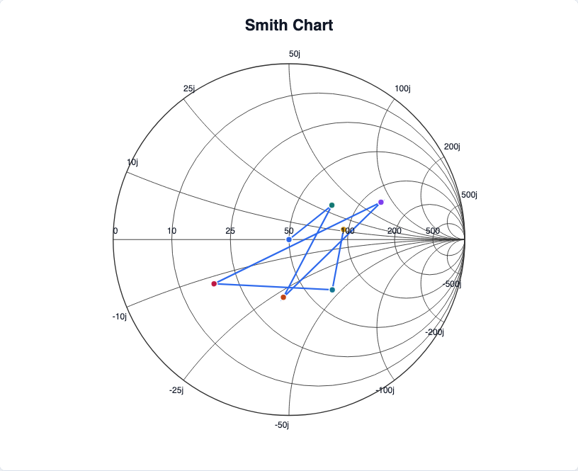

# ECharts Extension

Language: English | [Chinese](./README_CN.md)

ECharts Extension is a gallery of distinctive chart forms for browsing, comparing, and choosing visual ideas. This page keeps the project overview simple and visual; click any chart name to open its dedicated page.

## Chart Gallery

<table>
  <tr>
    <td align="center" width="50%">
      <a href="./packages/echarts-radial/README.md"><strong>Radial</strong></a> 
      
    </td>
    <td align="center" width="50%">
      <a href="./packages/echarts-concentric/README.md"><strong>Concentric</strong></a> 
      
    </td>
  </tr>
  <tr>
    <td align="center" width="50%">
      <a href="./packages/echarts-grid/README.md"><strong>Grid</strong></a> 
      
    </td>
    <td align="center" width="50%">
      <a href="./packages/echarts-mds/README.md"><strong>MDS</strong></a> 
      
    </td>
  </tr>
  <tr>
    <td align="center" width="50%">
      <a href="./packages/echarts-arc/README.md"><strong>Arc</strong></a> 
      
    </td>
    <td align="center" width="50%">
      <a href="./packages/echarts-radial-area/README.md"><strong>Radial Area</strong></a> 
      
    </td>
  </tr>
  <tr>
    <td align="center" width="50%">
      <a href="./packages/echarts-radial-boxplot/README.md"><strong>Radial Boxplot</strong></a> 
      
    </td>
    <td align="center" width="50%">
      <a href="./packages/echarts-venn/README.md"><strong>Venn Hollow</strong></a> 
      
    </td>
  </tr>
  <tr>
    <td align="center" width="50%">
      <a href="./packages/echarts-venn/README.md"><strong>Venn Bubble</strong></a> 
      
    </td>
    <td align="center" width="50%">
      <a href="./packages/echarts-pack-bubble/README.md"><strong>Pack Bubble</strong></a> 
      
    </td>
  </tr>
  <tr>
    <td align="center" width="50%">
      <a href="./packages/echarts-circle-packing/README.md"><strong>Circle Packing</strong></a> 
      
    </td>
    <td align="center" width="50%">
      <a href="./packages/echarts-nested-circle/README.md"><strong>Nested Circle</strong></a> 
      
    </td>
  </tr>
  <tr>
    <td align="center" width="50%">
      <a href="./packages/echarts-organization-chart/README.md"><strong>Organization Chart</strong></a> 
      
    </td>
    <td align="center" width="50%">
      <a href="./packages/echarts-mosaic/README.md"><strong>Mosaic</strong></a> 
      
    </td>
  </tr>
  <tr>
    <td align="center" width="50%">
      <a href="./packages/echarts-voronoi-treemap/README.md"><strong>Voronoi Treemap</strong></a> 
      
    </td>
    <td align="center" width="50%">
      <a href="./packages/echarts-subway/README.md"><strong>Subway</strong></a> 
      
    </td>
  </tr>
  <tr>
    <td align="center" width="50%">
      <a href="./packages/echarts-sequence-diagram/README.md"><strong>Sequence Diagram</strong></a> 
      
    </td>
    <td align="center" width="50%">
      <a href="./packages/echarts-cause-effect/README.md"><strong>Cause and Effect</strong></a> 
      
    </td>
  </tr>
  <tr>
    <td align="center" width="50%">
      <a href="./packages/echarts-flame/README.md"><strong>Flame</strong></a> 
      
    </td>
    <td align="center" width="50%">
      <a href="./packages/echarts-sunrise-sunset/README.md"><strong>Sunrise Sunset</strong></a> 
      
    </td>
  </tr>
  <tr>
    <td align="center" width="50%">
      <a href="./packages/echarts-lollipop/README.md"><strong>Lollipop</strong></a> 
      
    </td>
    <td align="center" width="50%">
      <a href="./packages/echarts-beeswarm/README.md"><strong>Beeswarm</strong></a> 
      
    </td>
  </tr>
  <tr>
    <td align="center" width="50%">
      <a href="./packages/echarts-spiral/README.md"><strong>Spiral</strong></a> 
      
    </td>
    <td align="center" width="50%">
      <a href="./packages/echarts-smith/README.md"><strong>Smith</strong></a> 
      
    </td>
  </tr>
  <tr>
    <td align="center" width="50%">
      <a href="./packages/echarts-vector-field/README.md"><strong>Vector Field</strong></a> 
      
    </td>
    <td align="center" width="50%">
      <a href="./packages/echarts-fractal/README.md"><strong>Fractal</strong></a> 
      
    </td>
  </tr>
  <tr>
    <td align="center" width="50%">
      <a href="./packages/echarts-fisheye/README.md"><strong>Fisheye</strong></a> 
      
    </td>
    <td align="center" width="50%">
      <a href="./packages/echarts-layout-core/README.md"><strong>Layout Core</strong></a> 
      
    </td>
  </tr>
</table>
