# ECharts Extension

语言：[English](./README.md) | 中文

ECharts Extension 收集了一组风格各异的可视化图表，适合用来浏览、比较和挑选图表形态。这里保留项目的整体印象和图表入口；点击图表名可进入对应页面。

## 网站

访问在线站点：[susiwen8.github.io/echarts-extension](https://susiwen8.github.io/echarts-extension/)。

- 示例入口：[docs/](https://susiwen8.github.io/echarts-extension/docs/)
- 配置文档：[docs/options.zh.html](https://susiwen8.github.io/echarts-extension/docs/options.zh.html)

## 图表一览

<table>
  <tr>
    <td align="center" width="50%">
      <a href="./packages/echarts-radial/README_CN.md"><strong>Radial</strong></a> 
      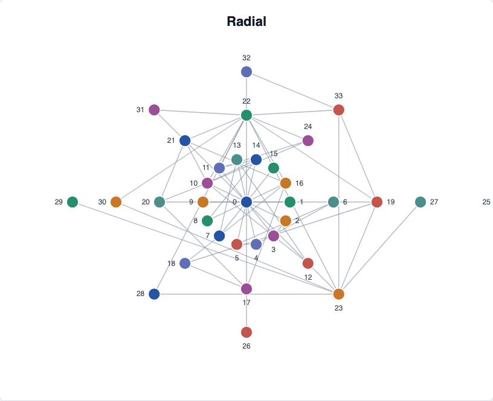
    </td>
    <td align="center" width="50%">
      <a href="./packages/echarts-concentric/README_CN.md"><strong>Concentric</strong></a> 
      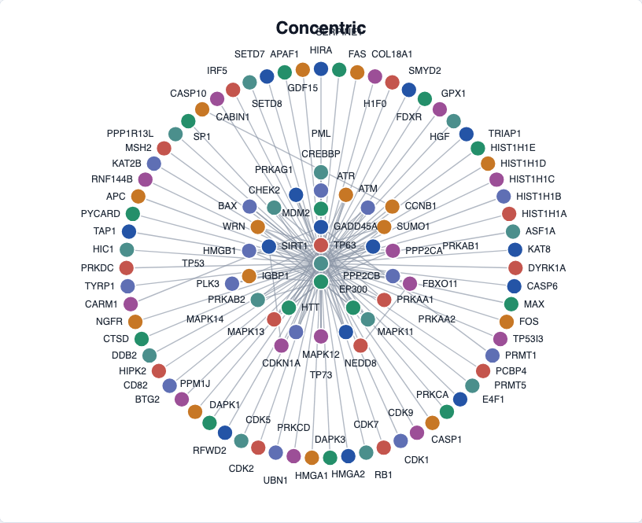
    </td>
  </tr>
  <tr>
    <td align="center" width="50%">
      <a href="./packages/echarts-grid/README_CN.md"><strong>Grid</strong></a> 
      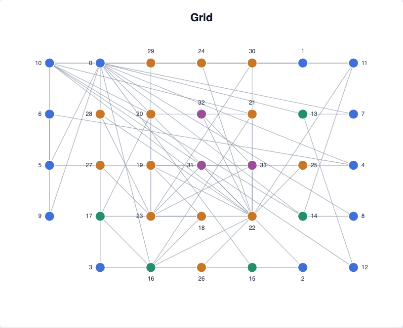
    </td>
    <td align="center" width="50%">
      <a href="./packages/echarts-mds/README_CN.md"><strong>MDS</strong></a> 
      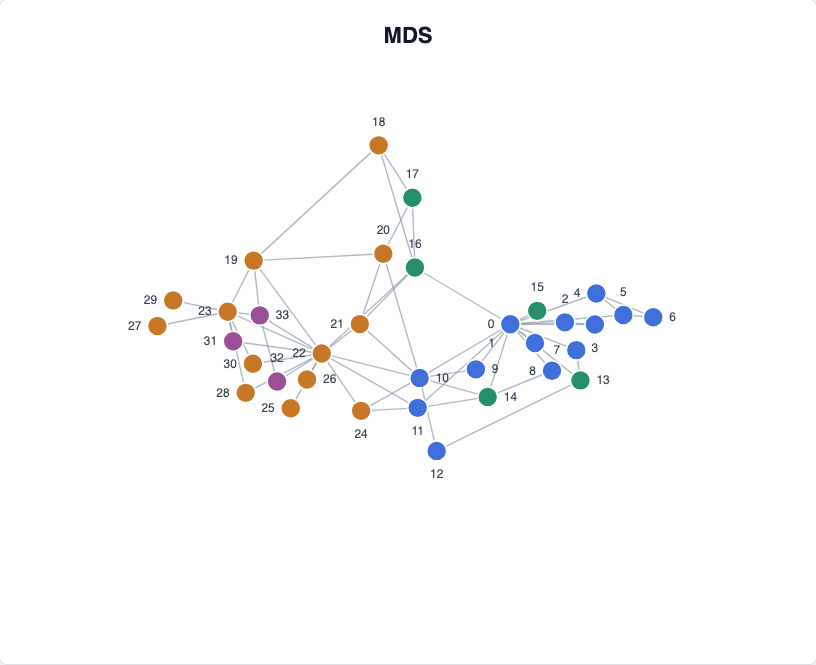
    </td>
  </tr>
  <tr>
    <td align="center" width="50%">
      <a href="./packages/echarts-arc/README_CN.md"><strong>Arc</strong></a> 
      
    </td>
    <td align="center" width="50%">
      <a href="./packages/echarts-radial-area/README_CN.md"><strong>Radial Area</strong></a> 
      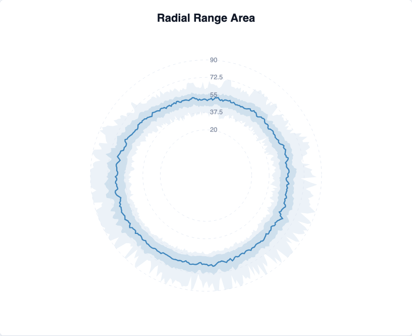
    </td>
  </tr>
  <tr>
    <td align="center" width="50%">
      <a href="./packages/echarts-radial-boxplot/README_CN.md"><strong>Radial Boxplot</strong></a> 
      
    </td>
    <td align="center" width="50%">
      <a href="./packages/echarts-venn/README_CN.md"><strong>Venn Hollow</strong></a> 
      
    </td>
  </tr>
  <tr>
    <td align="center" width="50%">
      <a href="./packages/echarts-venn/README_CN.md"><strong>Venn Bubble</strong></a> 
      
    </td>
    <td align="center" width="50%">
      <a href="./packages/echarts-pack-bubble/README_CN.md"><strong>Pack Bubble</strong></a> 
      
    </td>
  </tr>
  <tr>
    <td align="center" width="50%">
      <a href="./packages/echarts-circle-packing/README_CN.md"><strong>Circle Packing</strong></a> 
      
    </td>
    <td align="center" width="50%">
      <a href="./packages/echarts-nested-circle/README_CN.md"><strong>Nested Circle</strong></a> 
      
    </td>
  </tr>
  <tr>
    <td align="center" width="50%">
      <a href="./packages/echarts-organization-chart/README_CN.md"><strong>Organization Chart</strong></a> 
      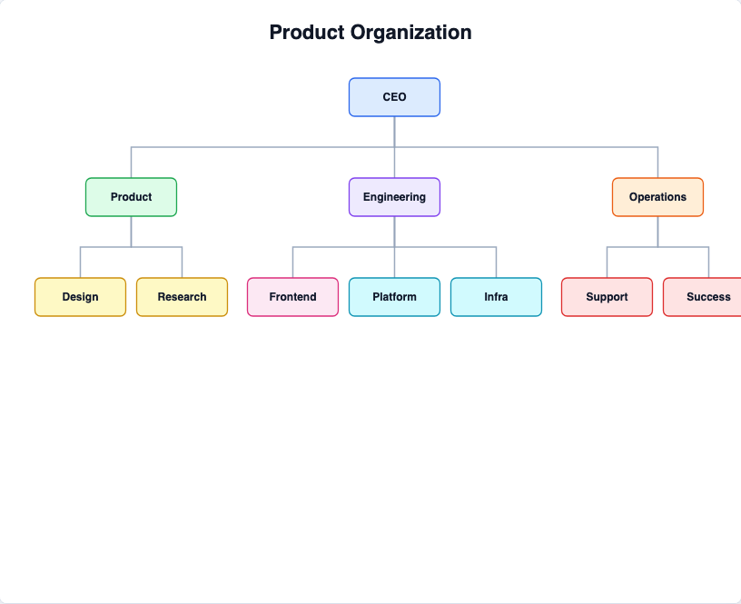
    </td>
    <td align="center" width="50%">
      <a href="./packages/echarts-mosaic/README_CN.md"><strong>Mosaic</strong></a> 
      
    </td>
  </tr>
  <tr>
    <td align="center" width="50%">
      <a href="./packages/echarts-voronoi-treemap/README_CN.md"><strong>Voronoi Treemap</strong></a> 
      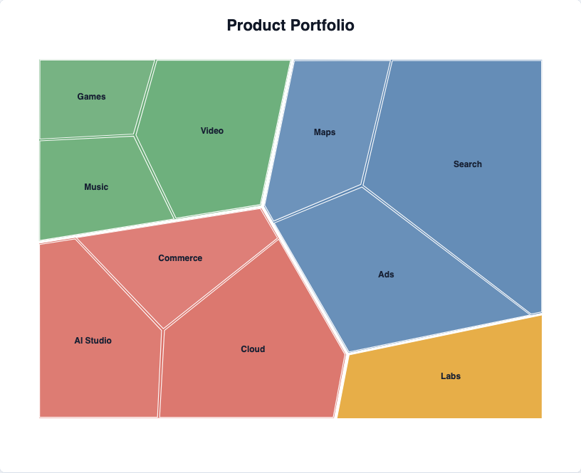
    </td>
    <td align="center" width="50%">
      <a href="./packages/echarts-subway/README_CN.md"><strong>Subway</strong></a> 
      
    </td>
  </tr>
  <tr>
    <td align="center" width="50%">
      <a href="./packages/echarts-sequence-diagram/README_CN.md"><strong>Sequence Diagram</strong></a> 
      
    </td>
    <td align="center" width="50%">
      <a href="./packages/echarts-cause-effect/README_CN.md"><strong>Cause and Effect</strong></a> 
      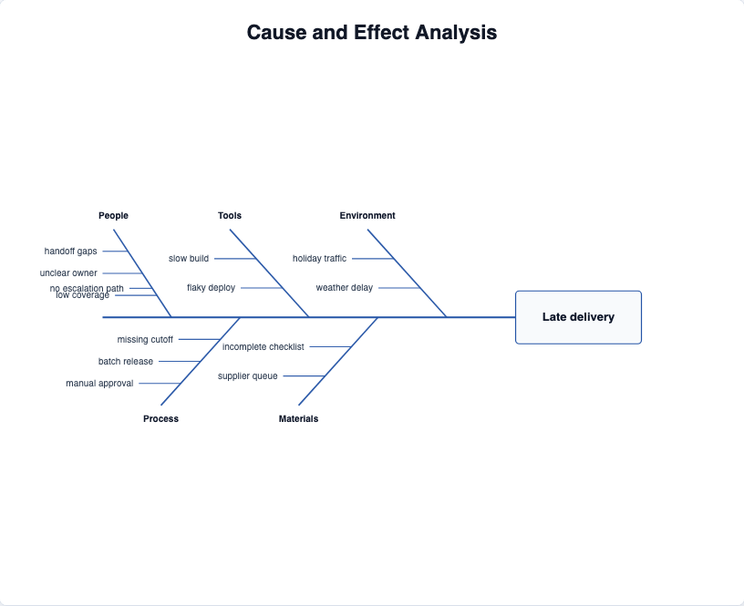
    </td>
  </tr>
  <tr>
    <td align="center" width="50%">
      <a href="./packages/echarts-flame/README_CN.md"><strong>Flame</strong></a> 
      
    </td>
    <td align="center" width="50%">
      <a href="./packages/echarts-sunrise-sunset/README_CN.md"><strong>Sunrise Sunset</strong></a> 
      
    </td>
  </tr>
  <tr>
    <td align="center" width="50%">
      <a href="./packages/echarts-lollipop/README_CN.md"><strong>Lollipop</strong></a> 
      
    </td>
    <td align="center" width="50%">
      <a href="./packages/echarts-beeswarm/README_CN.md"><strong>Beeswarm</strong></a> 
      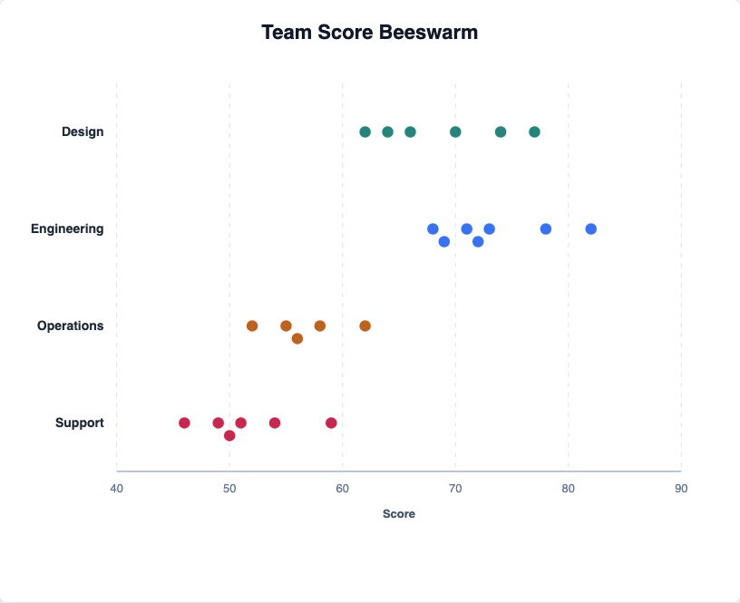
    </td>
  </tr>
  <tr>
    <td align="center" width="50%">
      <a href="./packages/echarts-spiral/README_CN.md"><strong>Spiral</strong></a> 
      
    </td>
    <td align="center" width="50%">
      <a href="./packages/echarts-smith/README_CN.md"><strong>Smith</strong></a> 
      
    </td>
  </tr>
  <tr>
    <td align="center" width="50%">
      <a href="./packages/echarts-vector-field/README_CN.md"><strong>Vector Field</strong></a> 
      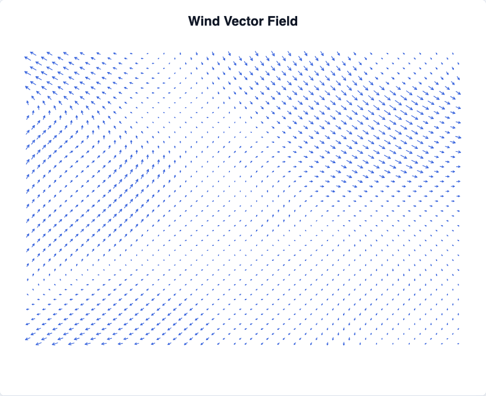
    </td>
    <td align="center" width="50%">
      <a href="./packages/echarts-fractal/README_CN.md"><strong>Fractal</strong></a> 
      
    </td>
  </tr>
  <tr>
    <td align="center" width="50%">
      <a href="./packages/echarts-fisheye/README_CN.md"><strong>Fisheye</strong></a> 
      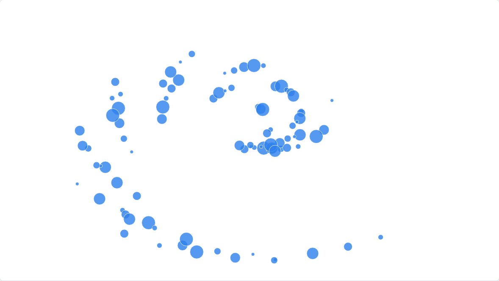
    </td>
    <td align="center" width="50%">
      <a href="./packages/echarts-layout-core/README_CN.md"><strong>Layout Core</strong></a> 
      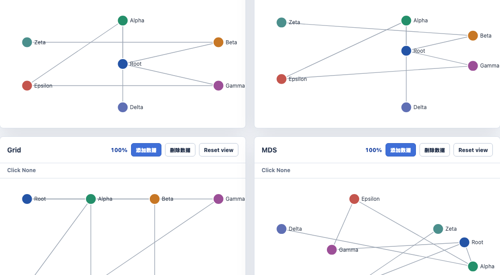
    </td>
  </tr>
</table>
