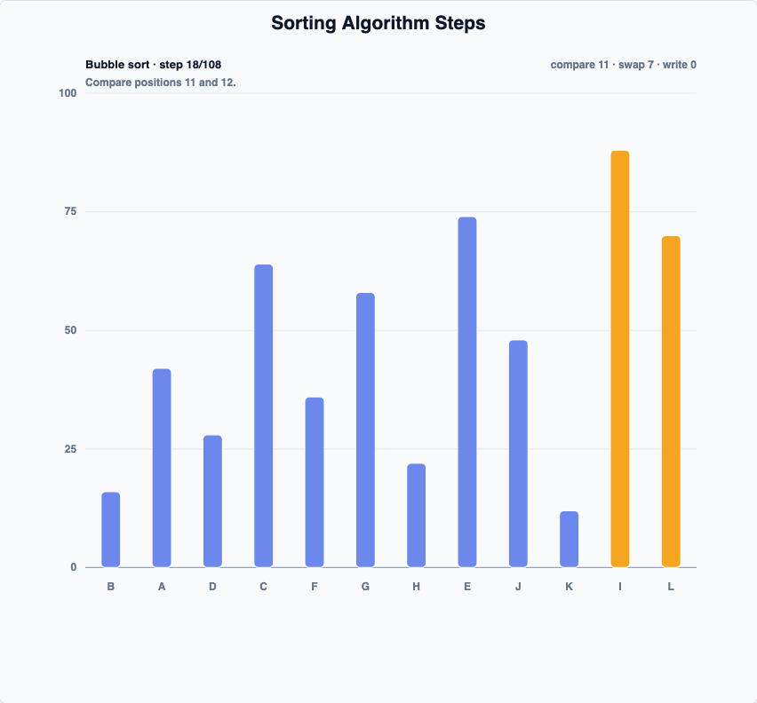

# @echarts-extension/algorithm-sort

Language: English | [中文](./README_CN.md)

ECharts extension chart for sorting algorithm visualization. Import this package for side effects to register `series.type = 'algorithmSort'`.



## Install

```bash
npm install echarts @echarts-extension/algorithm-sort
```

## Basic Usage

```js
import * as echarts from 'echarts';
import '@echarts-extension/algorithm-sort';

const chart = echarts.init(document.getElementById('main'));

chart.setOption({
  series: [
    {
      type: 'algorithmSort',
      algorithm: 'quick',
      currentStep: 12,
      data: [
        { name: 'A', value: 42 },
        { name: 'B', value: 16 },
        { name: 'C', value: 64 },
        { name: 'D', value: 28 }
      ]
    }
  ]
});
```

## Algorithms

The first release covers bubble, selection, insertion, merge, quick, and heap sort. The series generates deterministic frames internally; change `currentStep` or `progress` to scrub through the algorithm. Fractional `currentStep` values interpolate bar positions between adjacent frames, so swaps move like a bar-racing transition instead of hard-cutting.

## Options

<!-- OPTIONS:START -->
This table is generated by `scripts/sync-options-from-readmes.mjs --write-readmes`. Update the English README option table, then run `npm run docs:sync-options` to refresh the docs page.

| Option | Description | Values |
| --- | --- | --- |
| `type` | Registers this package series with ECharts. | `'algorithmSort'` |
| `silent` | Disables mouse events for the series when true. | `boolean` |
| `width` | Series box width. | `number \| string (pixel or percent)` |
| `height` | Series box height. | `number \| string (pixel or percent)` |
| `top` | Distance from the top of the chart container. | `number \| string (pixel or percent)` |
| `right` | Distance from the right of the chart container. | `number \| string (pixel or percent)` |
| `bottom` | Distance from the bottom of the chart container. | `number \| string (pixel or percent)` |
| `left` | Distance from the left of the chart container. | `number \| string (pixel or percent)` |
| `data` | Values to sort. Numbers, object rows, and array rows are supported. | `Array<number \| object \| unknown[]>` |
| `values` | Alias input for numeric or row values. | `Array<number \| object \| unknown[]>` |
| `data.name` | Display name for a value. | `string \| number` |
| `data.value` | Numeric value used by the algorithm. | `number` |
| `dimensions` | Names tuple columns when data rows are arrays. | `string[]` |
| `valueField` | Field used for numeric values. | `string \| number` |
| `nameField` | Field used for item names. | `string \| number` |
| `algorithm` | Sorting algorithm to visualize. | `'bubble' \| 'selection' \| 'insertion' \| 'merge' \| 'quick' \| 'heap'` |
| `order` | Sort direction. | `'ascending' \| 'descending'` |
| `currentStep` | Frame index to render; fractional values animate between adjacent frames. | `number` |
| `progress` | Normalized frame progress; ignored when `currentStep` is set. | `number (0-1)` |
| `maxItems` | Maximum number of input values used for frame generation. | `number` |
| `maxFrames` | Safety cap for generated frames. | `number` |
| `padding` | Inset around the chart. | `number \| object` |
| `padding.top` | Top inset. | `number` |
| `padding.right` | Right inset. | `number` |
| `padding.bottom` | Bottom inset. | `number` |
| `padding.left` | Left inset. | `number` |
| `min` | Manual value-axis minimum. | `number` |
| `max` | Manual value-axis maximum. | `number` |
| `nice` | Rounds value extent to nicer tick values. | `boolean` |
| `tickCount` | Preferred value-axis tick count. | `number` |
| `barWidth` | Fixed bar width. | `number` |
| `grid` | Shows or hides chart grid lines. | `Object` |
| `grid.show` | Shows the grid when true. | `boolean` |
| `valueAxis` | Controls value-axis labels and lines. | `Object` |
| `valueAxis.show` | Shows the value axis when true. | `boolean` |
| `valueAxis.label` | Styles value-axis labels. | `Object` |
| `valueAxis.splitLine` | Styles value split lines. | `Object` |
| `valueAxis.axisLine` | Styles the baseline. | `Object` |
| `categoryAxis` | Controls item labels along the baseline. | `Object` |
| `categoryAxis.show` | Shows item labels when true. | `boolean` |
| `categoryAxis.label` | Styles item labels. | `Object` |
| `itemStyle` | Base bar style. | `Object` |
| `itemStyle.color` | Base bar fill color. | `string` |
| `itemStyle.opacity` | Base bar opacity. | `number` |
| `itemStyle.borderColor` | Bar border color. | `string` |
| `itemStyle.borderWidth` | Bar border width. | `number` |
| `stateStyle` | Per-state bar colors. | `Object` |
| `stateStyle.compare.color` | Color for compared bars. | `string` |
| `stateStyle.swap.color` | Color for swapped bars. | `string` |
| `stateStyle.write.color` | Color for merge-write bars. | `string` |
| `stateStyle.pivot.color` | Color for quick-sort pivot bars. | `string` |
| `stateStyle.sorted.color` | Color for fixed sorted bars. | `string` |
| `rangeStyle` | Highlight style for active merge, quick, or heap ranges. | `Object` |
| `rangeStyle.color` | Range highlight color. | `string` |
| `rangeStyle.opacity` | Range highlight opacity. | `number` |
| `label` | Styles value labels above bars. | `Object` |
| `label.show` | Shows value labels when true. | `boolean` |
| `label.color` | Label text color. | `string` |
| `label.fontSize` | Label text size. | `number` |
| `label.fontWeight` | Label font weight. | `string \| number` |
| `label.formatter` | Formats label text. | `string \| function` |
| `stepLabel` | Styles the current-step annotation. | `Object` |
| `stepLabel.show` | Shows the step annotation when true. | `boolean` |
| `stepLabel.color` | Primary step text color. | `string` |
| `stepLabel.mutedColor` | Secondary step text color. | `string` |
| `stepLabel.fontSize` | Step text size. | `number` |
| `stepLabel.fontWeight` | Step text font weight. | `string \| number` |
| `emphasis` | Styles bars while hovered. | `Object` |
| `emphasis.itemStyle` | Nested item style option. | `object` |
<!-- OPTIONS:END -->
