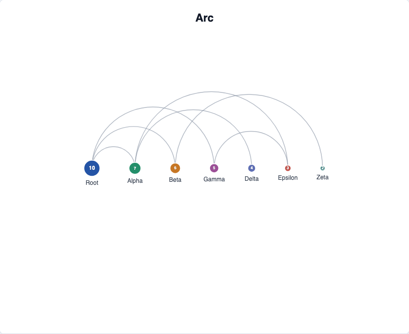

# @echarts-extension/arc

语言：[English](./README.md) | 中文

ECharts 自定义弧形图布局扩展。导入本包即可注册 `series.type = 'arc'`。



## 安装

```bash
npm install echarts @echarts-extension/arc
```

## 基础用法

```js
import * as echarts from 'echarts';
import '@echarts-extension/arc';

const chart = echarts.init(document.getElementById('main'));

chart.setOption({
  series: [
    {
      type: 'arc',
      data: [
        { id: 'root', value: 10 },
        { id: 'a', value: 4 },
        { id: 'b', value: 3 }
      ],
      links: [
        { source: 'root', target: 'a' },
        { source: 'root', target: 'b' }
      ],
      label: { show: true },
      layout: {
        nodeSep: 58,
        nodeSize: 18,
        preventOverlap: true
      }
    }
  ]
});
```

## 数据

使用 ECharts 图关系风格输入：

- `data` 或 `nodes` 表示节点。
- `links` 或 `edges` 表示连接。
- 每条连线使用 `source` 和 `target`，对应节点的 `id` 或 `name`。
- 省略 `symbolSize` 时，会根据数值型 `value` 推断节点大小。

## 常用选项

- `layout.nodeSep`：弧形节点之间的水平间距。
- `layout.nodeSize`：固定节点大小，或返回大小的函数。
- `layout.begin`：布局起点。
- `layout.preventOverlap`：标签或图形碰撞时将节点轻微分开。
- `edgeAnimation`：`true` 使用默认连线绘制动画，`false` 关闭动画，也可以传入包含 `duration`、`delay`、`stagger` 和 `easing` 的对象。

## 配置项

<!-- OPTIONS:START -->
此表由 `scripts/sync-options-from-readmes.mjs --write-readmes` 生成。更新英文 README 的配置表后，运行 `npm run docs:sync-options` 可刷新文档页。

| 配置项 | 说明 | 可选值 |
| --- | --- | --- |
| `type` | 向 ECharts 注册该包的系列类型。 | `'arc'` |
| `silent` | 为 true 时禁用mouse events for the 系列。 | `布尔值` |
| `width` | 系列区域宽度。 | `数字 \| 字符串 (像素或百分比)` |
| `height` | 系列区域高度。 | `数字 \| 字符串 (像素或百分比)` |
| `top` | 距离图表容器顶部的距离。 | `数字 \| 字符串 (像素或百分比)` |
| `right` | 距离图表容器右侧的距离。 | `数字 \| 字符串 (像素或百分比)` |
| `bottom` | 距离图表容器底部的距离。 | `数字 \| 字符串 (像素或百分比)` |
| `left` | 距离图表容器左侧的距离。 | `数字 \| 字符串 (像素或百分比)` |
| `data` | 图节点。每个节点可以包含 id, name, value, itemStyle, label, x, y, 或 size fields。与 nodes 效果相同。 | `数组<对象 \| 未知[]>` |
| `data.id` | 记录 ID。 | `字符串 \| 数字` |
| `data.name` | 显示名称。 | `字符串` |
| `data.value` | 数值。 | `数字` |
| `data.itemStyle` | 单条记录的图元样式。 | `对象` |
| `data.itemStyle.color` | 填充颜色。 | `字符串` |
| `data.itemStyle.fill` | 填充颜色的别名。 | `字符串` |
| `data.itemStyle.opacity` | 填充透明度。 | `数字` |
| `data.itemStyle.borderColor` | 边框颜色。 | `字符串` |
| `data.itemStyle.borderWidth` | 边框宽度。 | `数字` |
| `data.itemStyle.borderRadius` | 圆角半径。 | `数字` |
| `data.itemStyle.shadowBlur` | 阴影模糊半径。 | `数字` |
| `data.itemStyle.shadowColor` | 阴影颜色。 | `字符串` |
| `data.itemStyle.lineWidth` | icon or shape 样式使用的Stroke 宽度。 | `数字` |
| `data.label` | 单条记录的标签样式。 | `对象` |
| `data.label.show` | 为 true 时显示标签。 | `布尔值` |
| `data.label.color` | 标签文字颜色。 | `字符串` |
| `data.label.fontSize` | 标签文字大小。 | `数字` |
| `data.label.fontWeight` | 标签字重。 | `字符串 \| 数字` |
| `data.label.formatter` | 格式化标签 文本。 | `字符串 \| 函数` |
| `data.x` | X 坐标或分类。 | `数字` |
| `data.y` | Y 坐标或分类。 | `数字` |
| `data.size` | 单条记录的大小。 | `数字` |
| `nodes` | 与 data 效果相同。图节点。每个节点可以包含 id, name, value, itemStyle, label, x, y, 或 size fields。 | `数组<对象 \| 未知[]>` |
| `nodes.id` | 记录 ID。 | `字符串 \| 数字` |
| `nodes.name` | 显示名称。 | `字符串` |
| `nodes.value` | 数值。 | `数字` |
| `nodes.itemStyle` | 单条记录的图元样式。 | `对象` |
| `nodes.itemStyle.color` | 填充颜色。 | `字符串` |
| `nodes.itemStyle.fill` | 填充颜色的别名。 | `字符串` |
| `nodes.itemStyle.opacity` | 填充透明度。 | `数字` |
| `nodes.itemStyle.borderColor` | 边框颜色。 | `字符串` |
| `nodes.itemStyle.borderWidth` | 边框宽度。 | `数字` |
| `nodes.itemStyle.borderRadius` | 圆角半径。 | `数字` |
| `nodes.itemStyle.shadowBlur` | 阴影模糊半径。 | `数字` |
| `nodes.itemStyle.shadowColor` | 阴影颜色。 | `字符串` |
| `nodes.itemStyle.lineWidth` | icon or shape 样式使用的Stroke 宽度。 | `数字` |
| `nodes.label` | 单条记录的标签样式。 | `对象` |
| `nodes.label.show` | 为 true 时显示标签。 | `布尔值` |
| `nodes.label.color` | 标签文字颜色。 | `字符串` |
| `nodes.label.fontSize` | 标签文字大小。 | `数字` |
| `nodes.label.fontWeight` | 标签字重。 | `字符串 \| 数字` |
| `nodes.label.formatter` | 格式化标签 文本。 | `字符串 \| 函数` |
| `nodes.x` | X 坐标或分类。 | `数字` |
| `nodes.y` | Y 坐标或分类。 | `数字` |
| `nodes.size` | 单条记录的大小。 | `数字` |
| `links` | 图 connections。Each 连接 connects source 和 target 节点 IDs or 名称s。与 edges 效果相同。 | `数组<对象>` |
| `links.source` | 源节点 ID 或名称。 | `字符串 \| 数字` |
| `links.target` | 目标节点 ID 或名称。 | `字符串 \| 数字` |
| `edges` | 与 links 效果相同。图 connections。Each 连接 connects source 和 target 节点 IDs or 名称s。 | `数组<对象>` |
| `edges.source` | 源节点 ID 或名称。 | `字符串 \| 数字` |
| `edges.target` | 目标节点 ID 或名称。 | `字符串 \| 数字` |
| `symbolSize` | 节点大小。省略时，numeric 数值 can be used to infer 大小。 | `数字 \| 数字[] \| 函数` |
| `center` | 系列 中心点 点 insIDe the 图表 矩形。 | `[数字 \| 字符串, 数字 \| 字符串]` |
| `layout` | Nested 图 布局 options。 | `对象` |
| `layoutOptions` | nested 图 布局 options的别名。 | `对象` |
| `layout.nodeSep` | 水平 间距 between arc 节点。与 nodeSep 效果相同。 | `数字` |
| `layout.nodeSize` | arc 间距使用的节点大小。与 nodeSize 效果相同。 | `数字 \| 数字[] \| 函数` |
| `nodeSep` | 与 layout.nodeSep 效果相同。水平 间距 between arc 节点。 | `数字` |
| `nodeSize` | 与 layout.nodeSize 效果相同。arc 间距使用的节点大小。 | `数字 \| 数字[] \| 函数` |
| `center` | 中心点 of the arc 节点 行 when a 视口 is supplied。 | `[数字 \| 字符串, 数字 \| 字符串]` |
| `itemStyle` | 设置图节点样式。 | `对象` |
| `itemStyle.color` | 主颜色。 | `字符串` |
| `itemStyle.opacity` | 透明度。 | `数字` |
| `itemStyle.borderColor` | 边框颜色。 | `字符串` |
| `itemStyle.borderWidth` | 边框宽度。 | `数字` |
| `itemStyle.shadowBlur` | 阴影模糊半径。 | `数字` |
| `itemStyle.shadowColor` | 阴影颜色。 | `字符串` |
| `edgeStyle` | 设置图边样式。 | `对象` |
| `edgeStyle.color` | 主颜色。 | `字符串` |
| `edgeStyle.stroke` | 描边颜色。 | `字符串` |
| `edgeStyle.width` | 宽度值。 | `数字` |
| `edgeStyle.lineWidth` | 线宽。 | `数字` |
| `edgeStyle.opacity` | 透明度。 | `数字` |
| `edgeStyle.type` | 线条或图元类型。 | `'solid' \| 'dashed' \| 'dotted' \| 数字[]` |
| `label` | 设置图 节点 标签样式。 | `对象` |
| `label.show` | 为 true 时显示标签。 | `布尔值` |
| `label.position` | 标签位置。 | `字符串` |
| `label.color` | 标签文字颜色。 | `字符串` |
| `label.fontSize` | 标签文字大小。 | `数字` |
| `label.fontWeight` | 标签字重。 | `字符串 \| 数字` |
| `label.formatter` | 格式化标签 文本。 | `字符串 \| 函数` |
| `label.offset` | Distance between 标签 and target element。 | `数字` |
| `emphasis` | 设置节点 and 边 while 悬停时样式。 | `对象` |
| `emphasis.itemStyle` | 嵌套 项 样式 选项。 | `对象` |
| `emphasis.itemStyle.color` | 填充颜色。 | `字符串` |
| `emphasis.itemStyle.fill` | 填充颜色的别名。 | `字符串` |
| `emphasis.itemStyle.opacity` | 填充透明度。 | `数字` |
| `emphasis.itemStyle.borderColor` | 边框颜色。 | `字符串` |
| `emphasis.itemStyle.borderWidth` | 边框宽度。 | `数字` |
| `emphasis.itemStyle.borderRadius` | 圆角半径。 | `数字` |
| `emphasis.itemStyle.shadowBlur` | 阴影模糊半径。 | `数字` |
| `emphasis.itemStyle.shadowColor` | 阴影颜色。 | `字符串` |
| `emphasis.itemStyle.lineWidth` | icon or shape 样式使用的Stroke 宽度。 | `数字` |
| `emphasis.edgeStyle` | 嵌套 边tyle 选项。 | `对象` |
| `emphasis.edgeStyle.color` | 填充颜色。 | `字符串` |
| `emphasis.edgeStyle.fill` | 填充颜色的别名。 | `字符串` |
| `emphasis.edgeStyle.opacity` | 填充透明度。 | `数字` |
| `emphasis.edgeStyle.borderColor` | 边框颜色。 | `字符串` |
| `emphasis.edgeStyle.borderWidth` | 边框宽度。 | `数字` |
| `emphasis.edgeStyle.borderRadius` | 圆角半径。 | `数字` |
| `emphasis.edgeStyle.shadowBlur` | 阴影模糊半径。 | `数字` |
| `emphasis.edgeStyle.shadowColor` | 阴影颜色。 | `字符串` |
| `emphasis.edgeStyle.lineWidth` | icon or shape 样式使用的Stroke 宽度。 | `数字` |
| `emphasis.focus` | 嵌套 focus 选项。 | `字符串` |
| `emphasis.blurScope` | 嵌套 blurScope 选项。 | `字符串` |
| `enterAnimation` | 为节点 into place添加动画。 | `布尔值 \| 对象` |
| `enterAnimation.show` | 为 true 时显示动画。 | `布尔值` |
| `enterAnimation.enabled` | 为 true 时启用动画。 | `布尔值` |
| `enterAnimation.duration` | 动画时长。 | `数字 \| 函数` |
| `enterAnimation.delay` | 动画开始前的延迟。 | `数字 \| 函数` |
| `enterAnimation.stagger` | 图元之间增加的延迟。 | `数字 \| 函数` |
| `enterAnimation.easing` | 动画缓动名称。 | `字符串` |
| `edgeAnimation` | 为边绘制添加动画。 | `布尔值 \| 对象` |
| `edgeAnimation.show` | 为 true 时显示动画。 | `布尔值` |
| `edgeAnimation.enabled` | 为 true 时启用动画。 | `布尔值` |
| `edgeAnimation.duration` | 动画时长。 | `数字 \| 函数` |
| `edgeAnimation.delay` | 动画开始前的延迟。 | `数字 \| 函数` |
| `edgeAnimation.stagger` | 图元之间增加的延迟。 | `数字 \| 函数` |
| `edgeAnimation.easing` | 动画缓动名称。 | `字符串` |
| `fisheye` | 配置built-in 指针 放大镜 for this 图 系列。 | `false \| 对象` |
| `fisheye.show` | 为 true 时显示and enables the 放大镜。 | `布尔值` |
| `fisheye.radius` | Lens 半径 around the 指针。 | `数字 \| 字符串 (像素或百分比)` |
| `fisheye.scale` | Magnification factor at the lens 中心点。 | `数字` |
| `fisheye.labelScale` | 标签 magnification factor near the lens 中心点。 | `数字` |
| `fisheye.stroke` | Lens out线 颜色。 | `字符串` |
| `fisheye.strokeWidth` | Lens out线 宽度。 | `数字` |
| `fisheye.opacity` | Lens out线 透明度。 | `数字` |
| `fisheye.preview` | 运行initial preview pulse when available。 | `布尔值` |
| `layoutAnimation` | E图表s 布局 动画 flag for the registered 系列。 | `布尔值` |
<!-- OPTIONS:END -->
