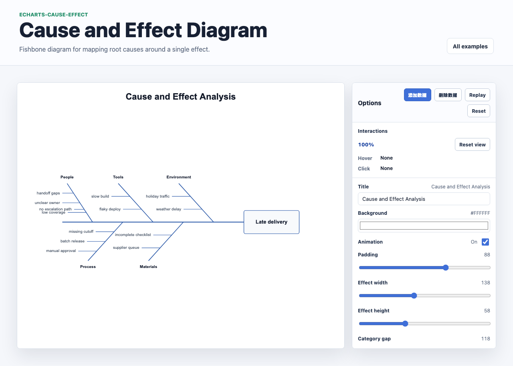

# @echarts-extension/cause-effect

语言：[English](./README.md) | 中文

ECharts 因果图（鱼骨图 / 石川图）扩展。



```js
import * as echarts from 'echarts';
import '@echarts-extension/cause-effect';

chart.setOption({
  series: [
    {
      type: 'causeEffect',
      effect: 'Late delivery',
      categories: [
        {
          name: 'People',
          causes: [
            'handoff gaps',
            { name: 'unclear owner', children: ['no escalation path'] }
          ]
        },
        ['Process', 'manual approval', 'batch release'],
        ['Tools', 'slow build']
      ],
      label: { show: true }
    }
  ]
});
```

该系列接受 `effect`，并通过 `categories`、`causes` 或 `data` 定义主要鱼骨分支。每个分类可以使用 `causes`、`items` 或 `children`；嵌套原因会作为次级骨架布局。
