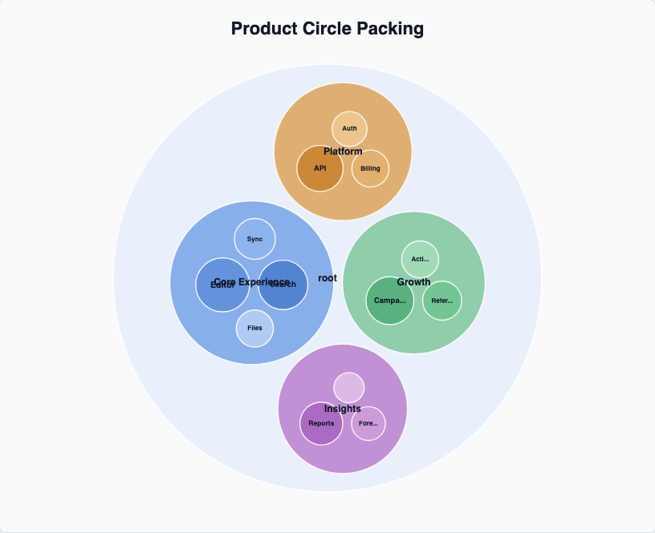

# @echarts-extension/circle-packing

Language: English | [中文](./README_CN.md)

ECharts extension chart for hierarchical circle packing diagrams. Import this package for side effects to register `series.type = 'circlePacking'`.



## Install

```bash
npm install echarts @echarts-extension/circle-packing
```

## Basic Usage

```js
import * as echarts from 'echarts';
import '@echarts-extension/circle-packing';

const chart = echarts.init(document.getElementById('main'));

chart.setOption({
  series: [
    {
      type: 'circlePacking',
      data: {
        name: 'Portfolio',
        children: [
          { name: 'Core', children: [{ name: 'Search', value: 54 }, { name: 'Editor', value: 38 }] },
          { name: 'Growth', children: [{ name: 'Campaigns', value: 32 }, { name: 'Referrals', value: 22 }] }
        ]
      },
      siblingGap: 2,
      nodePadding: 4,
      label: { show: true }
    }
  ]
});
```

## Data

Use one root object or an array of roots:

- Children can be stored in `children` or configured with `childrenField`.
- Values default to `value`; use `valueField` for nested fields such as `metrics.size`.
- Names default to `name`; use `nameField` for custom data.
- Set `rootVisible: false` to hide a synthetic root when passing an array.

## Useful Options

- `padding`, `nodePadding`, `siblingGap`: spacing controls.
- `center`, `radius`: circle packing viewport controls.
- `rootName`, `rootVisible`: root behavior.
- `sort`: `value`, `name`, `asc`, `desc`, `none`, `true`, or `false`.
- `colors`, `itemStyle`, `label`, `emphasis`, `enterAnimation`: presentation controls.
