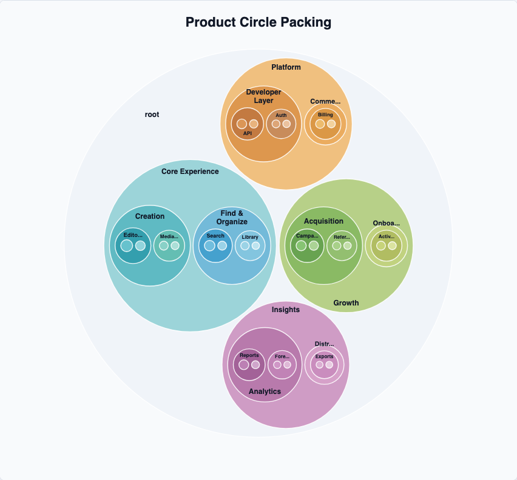

# @echarts-extension/circle-packing

Language: English | [中文](./README_CN.md)

ECharts extension chart for hierarchical circle packing diagrams. Import this package for side effects to register `series.type = 'circlePacking'`.



## Install

```bash
npm install echarts @echarts-extension/circle-packing
```

## Basic Usage

```js
import * as echarts from 'echarts';
import '@echarts-extension/circle-packing';

const chart = echarts.init(document.getElementById('main'));

chart.setOption({
  series: [
    {
      type: 'circlePacking',
      data: {
        name: 'Portfolio',
        children: [
          { name: 'Core', children: [{ name: 'Search', value: 54 }, { name: 'Editor', value: 38 }] },
          { name: 'Growth', children: [{ name: 'Campaigns', value: 32 }, { name: 'Referrals', value: 22 }] }
        ]
      },
      siblingGap: 2,
      nodePadding: 4,
      label: { show: true }
    }
  ]
});
```

## Data

Use one root object or an array of roots:

- Children can be stored in `children` or configured with `childrenField`.
- Values default to `value`; use `valueField` for nested fields such as `metrics.size`.
- Names default to `name`; use `nameField` for custom data.
- Set `rootVisible: false` to hide a synthetic root when passing an array.

## Options

<!-- OPTIONS:START -->
This table is generated by `scripts/sync-options-from-readmes.mjs --write-readmes`. Update the English README option table, then run `npm run docs:sync-options` to refresh the docs page.

| Option | Description | Values |
| --- | --- | --- |
| `type` | Registers this package series with ECharts. | `'circlePacking'` |
| `silent` | Disables mouse events for the series when true. | `boolean` |
| `width` | Series box width. | `number \| string (pixel or percent)` |
| `height` | Series box height. | `number \| string (pixel or percent)` |
| `top` | Distance from the top of the chart container. | `number \| string (pixel or percent)` |
| `right` | Distance from the right of the chart container. | `number \| string (pixel or percent)` |
| `bottom` | Distance from the bottom of the chart container. | `number \| string (pixel or percent)` |
| `left` | Distance from the left of the chart container. | `number \| string (pixel or percent)` |
| `data` | Hierarchical records to pack into nested circles. | `Object \| Array<object>` |
| `data.id` | Record id. | `string \| number` |
| `data.parentId` | Parent record id. | `string \| number` |
| `data.name` | Display name. | `string` |
| `data.value` | Numeric value. | `number` |
| `data.children` | Child records. | `Array<object>` |
| `data.children.id` | Record id. | `string \| number` |
| `data.children.parentId` | Parent record id. | `string \| number` |
| `data.children.name` | Display name. | `string` |
| `data.children.value` | Numeric value. | `number` |
| `data.children.children` | Child records. | `Array<object>` |
| `data.children.children.name` | Display name. | `string` |
| `data.children.children.value` | Numeric value. | `number` |
| `data.children.children.itemStyle` | Per-record item style. | `Object` |
| `data.children.children.itemStyle.color` | Fill color. | `string` |
| `data.children.children.itemStyle.fill` | Alias for fill color. | `string` |
| `data.children.children.itemStyle.opacity` | Fill opacity. | `number` |
| `data.children.children.itemStyle.borderColor` | Border color. | `string` |
| `data.children.children.itemStyle.borderWidth` | Border width. | `number` |
| `data.children.children.itemStyle.borderRadius` | Corner radius. | `number` |
| `data.children.children.itemStyle.shadowBlur` | Shadow blur radius. | `number` |
| `data.children.children.itemStyle.shadowColor` | Shadow color. | `string` |
| `data.children.children.itemStyle.lineWidth` | Stroke width used by icon or shape styles. | `number` |
| `data.children.children.label` | Per-record label style. | `Object` |
| `data.children.children.label.show` | Shows labels when true. | `boolean` |
| `data.children.children.label.color` | Label text color. | `string` |
| `data.children.children.label.fontSize` | Label text size. | `number` |
| `data.children.children.label.fontWeight` | Label font weight. | `string \| number` |
| `data.children.children.label.formatter` | Formats label text. | `string \| function` |
| `data.children.itemStyle` | Per-record item style. | `Object` |
| `data.children.itemStyle.color` | Fill color. | `string` |
| `data.children.itemStyle.fill` | Alias for fill color. | `string` |
| `data.children.itemStyle.opacity` | Fill opacity. | `number` |
| `data.children.itemStyle.borderColor` | Border color. | `string` |
| `data.children.itemStyle.borderWidth` | Border width. | `number` |
| `data.children.itemStyle.borderRadius` | Corner radius. | `number` |
| `data.children.itemStyle.shadowBlur` | Shadow blur radius. | `number` |
| `data.children.itemStyle.shadowColor` | Shadow color. | `string` |
| `data.children.itemStyle.lineWidth` | Stroke width used by icon or shape styles. | `number` |
| `data.children.label` | Per-record label style. | `Object` |
| `data.children.label.show` | Shows labels when true. | `boolean` |
| `data.children.label.color` | Label text color. | `string` |
| `data.children.label.fontSize` | Label text size. | `number` |
| `data.children.label.fontWeight` | Label font weight. | `string \| number` |
| `data.children.label.formatter` | Formats label text. | `string \| function` |
| `data.itemStyle` | Per-record item style. | `Object` |
| `data.itemStyle.color` | Fill color. | `string` |
| `data.itemStyle.fill` | Alias for fill color. | `string` |
| `data.itemStyle.opacity` | Fill opacity. | `number` |
| `data.itemStyle.borderColor` | Border color. | `string` |
| `data.itemStyle.borderWidth` | Border width. | `number` |
| `data.itemStyle.borderRadius` | Corner radius. | `number` |
| `data.itemStyle.shadowBlur` | Shadow blur radius. | `number` |
| `data.itemStyle.shadowColor` | Shadow color. | `string` |
| `data.itemStyle.lineWidth` | Stroke width used by icon or shape styles. | `number` |
| `data.label` | Per-record label style. | `Object` |
| `data.label.show` | Shows labels when true. | `boolean` |
| `data.label.color` | Label text color. | `string` |
| `data.label.fontSize` | Label text size. | `number` |
| `data.label.fontWeight` | Label font weight. | `string \| number` |
| `data.label.formatter` | Formats label text. | `string \| function` |
| `rootName` | Display name for an implicit root node. | `string` |
| `rootVisible` | Shows the root circle when true. | `boolean` |
| `padding` | Inset around the circle packing layout. | `number \| object` |
| `padding.top` | Top inset. | `number` |
| `padding.right` | Right inset. | `number` |
| `padding.bottom` | Bottom inset. | `number` |
| `padding.left` | Left inset. | `number` |
| `nodePadding` | Padding inside parent circles. | `number` |
| `siblingGap` | Space between sibling circles. | `number` |
| `center` | Center point of the packed hierarchy. | `[number \| string, number \| string]` |
| `radius` | Outer radius of the packed hierarchy. | `number \| string (pixel or percent)` |
| `valueField` | Field used for circle size. | `string` |
| `nameField` | Field used for labels and names. | `string` |
| `childrenField` | Field containing child nodes. | `string` |
| `sort` | Sorts hierarchy nodes before layout. | `boolean \| 'none' \| 'value' \| 'name' \| 'asc' \| 'desc'` |
| `colors` | Palette used by depth or groups. | `string[]` |
| `layout` | Nested hierarchy layout options. | `Object` |
| `layout.rootName` | Display name for an implicit root node. | `string` |
| `layout.rootVisible` | Shows the root circle when true. | `boolean` |
| `layout.padding` | Inset around the hierarchy. | `number \| object` |
| `layout.padding.top` | Top inset. | `number` |
| `layout.padding.right` | Right inset. | `number` |
| `layout.padding.bottom` | Bottom inset. | `number` |
| `layout.padding.left` | Left inset. | `number` |
| `layout.nodePadding` | Padding inside parent circles. | `number` |
| `layout.siblingGap` | Space between sibling circles. | `number` |
| `layout.center` | Center point of the packed hierarchy. | `[number \| string, number \| string]` |
| `layout.radius` | Outer radius of the packed hierarchy. | `number \| string (pixel or percent)` |
| `layout.valueField` | Field used for circle size. | `string` |
| `layout.nameField` | Field used for labels and names. | `string` |
| `layout.childrenField` | Field containing child nodes. | `string` |
| `layout.sort` | Sorts hierarchy nodes before layout. | `boolean \| 'none' \| 'value' \| 'name' \| 'asc' \| 'desc'` |
| `layoutOptions` | Alias for nested hierarchy layout options. | `Same fields as layout` |
| `layoutOptions.rootName` | Display name for an implicit root node. | `string` |
| `layoutOptions.rootVisible` | Shows the root circle when true. | `boolean` |
| `layoutOptions.padding` | Inset around the hierarchy. | `number \| object` |
| `layoutOptions.padding.top` | Top inset. | `number` |
| `layoutOptions.padding.right` | Right inset. | `number` |
| `layoutOptions.padding.bottom` | Bottom inset. | `number` |
| `layoutOptions.padding.left` | Left inset. | `number` |
| `layoutOptions.nodePadding` | Padding inside parent circles. | `number` |
| `layoutOptions.siblingGap` | Space between sibling circles. | `number` |
| `layoutOptions.center` | Center point of the packed hierarchy. | `[number \| string, number \| string]` |
| `layoutOptions.radius` | Outer radius of the packed hierarchy. | `number \| string (pixel or percent)` |
| `layoutOptions.valueField` | Field used for circle size. | `string` |
| `layoutOptions.nameField` | Field used for labels and names. | `string` |
| `layoutOptions.childrenField` | Field containing child nodes. | `string` |
| `layoutOptions.sort` | Sorts hierarchy nodes before layout. | `boolean \| 'none' \| 'value' \| 'name' \| 'asc' \| 'desc'` |
| `enterAnimation` | Animates circles into place. | `boolean \| object` |
| `enterAnimation.show` | Shows the animation when true. | `boolean` |
| `enterAnimation.enabled` | Enables the animation when true. | `boolean` |
| `enterAnimation.duration` | Animation duration. | `number \| function` |
| `enterAnimation.delay` | Delay before the animation starts. | `number \| function` |
| `enterAnimation.stagger` | Delay added between items. | `number \| function` |
| `enterAnimation.easing` | Animation easing name. | `string` |
| `focusAnimation` | Animates click-to-focus zoom transitions. | `boolean \| object` |
| `focusAnimation.show` | Shows the focus animation when true. | `boolean` |
| `focusAnimation.enabled` | Enables the focus animation when true. | `boolean` |
| `focusAnimation.duration` | Focus animation duration. | `number` |
| `focusAnimation.easing` | Focus animation easing name. | `string` |
| `itemStyle` | Styles circles. | `Object` |
| `itemStyle.color` | Primary color. | `string` |
| `itemStyle.opacity` | Opacity. | `number` |
| `itemStyle.borderColor` | Border color. | `string` |
| `itemStyle.borderWidth` | Border width. | `number` |
| `itemStyle.shadowBlur` | Shadow blur radius. | `number` |
| `itemStyle.shadowColor` | Shadow color. | `string` |
| `label` | Styles circle labels. | `Object` |
| `label.show` | Shows labels when true. | `boolean` |
| `label.color` | Label text color. | `string` |
| `label.fontSize` | Label text size. | `number` |
| `label.fontWeight` | Label font weight. | `string \| number` |
| `label.formatter` | Formats label text. | `string \| function` |
| `label.lineHeight` | Label line height. | `number` |
| `label.minRadius` | Minimum radius required before the label is shown. | `number` |
| `emphasis` | Styles circles while hovered. | `Object` |
| `emphasis.itemStyle` | Nested item style option. | `object` |
| `emphasis.itemStyle.color` | Fill color. | `string` |
| `emphasis.itemStyle.fill` | Alias for fill color. | `string` |
| `emphasis.itemStyle.opacity` | Fill opacity. | `number` |
| `emphasis.itemStyle.borderColor` | Border color. | `string` |
| `emphasis.itemStyle.borderWidth` | Border width. | `number` |
| `emphasis.itemStyle.borderRadius` | Corner radius. | `number` |
| `emphasis.itemStyle.shadowBlur` | Shadow blur radius. | `number` |
| `emphasis.itemStyle.shadowColor` | Shadow color. | `string` |
| `emphasis.itemStyle.lineWidth` | Stroke width used by icon or shape styles. | `number` |
| `emphasis.edgeStyle` | Nested edgeStyle option. | `object` |
| `emphasis.edgeStyle.color` | Fill color. | `string` |
| `emphasis.edgeStyle.fill` | Alias for fill color. | `string` |
| `emphasis.edgeStyle.opacity` | Fill opacity. | `number` |
| `emphasis.edgeStyle.borderColor` | Border color. | `string` |
| `emphasis.edgeStyle.borderWidth` | Border width. | `number` |
| `emphasis.edgeStyle.borderRadius` | Corner radius. | `number` |
| `emphasis.edgeStyle.shadowBlur` | Shadow blur radius. | `number` |
| `emphasis.edgeStyle.shadowColor` | Shadow color. | `string` |
| `emphasis.edgeStyle.lineWidth` | Stroke width used by icon or shape styles. | `number` |
| `emphasis.focus` | Nested focus option. | `string` |
| `emphasis.blurScope` | Nested blurScope option. | `string` |
<!-- OPTIONS:END -->
