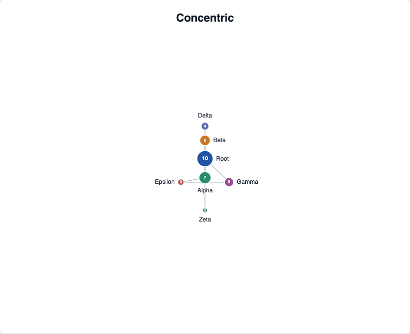

# @echarts-extension/concentric

语言：[English](./README.md) | 中文

ECharts 自定义同心圆图布局扩展。导入本包即可注册 `series.type = 'concentric'`。



## 安装

```bash
npm install echarts @echarts-extension/concentric
```

## 基础用法

```js
import * as echarts from 'echarts';
import '@echarts-extension/concentric';

const chart = echarts.init(document.getElementById('main'));

chart.setOption({
  series: [
    {
      type: 'concentric',
      data: [
        { id: 'hub', value: 20 },
        { id: 'ops', value: 8 },
        { id: 'sales', value: 6 },
        { id: 'support', value: 5 }
      ],
      links: [
        { source: 'hub', target: 'ops' },
        { source: 'hub', target: 'sales' },
        { source: 'hub', target: 'support' }
      ],
      label: { show: true },
      layout: {
        sortBy: 'degree',
        preventOverlap: true,
        nodeSpacing: 16
      }
    }
  ]
});
```

## 数据

使用 ECharts 图关系风格输入：

- `data` 或 `nodes` 表示节点。
- `links` 或 `edges` 表示连接。
- 每条连线使用 `source` 和 `target`，对应节点的 `id` 或 `name`。
- 省略 `symbolSize` 时，会根据数值型 `value` 推断节点大小。

## 常用选项

- `layout.sortBy`：用于将节点排序到圆环中的字段名或函数。`degree` 适合优先放置枢纽节点。
- `layout.equidistant`：保持圆环间距均匀。
- `layout.startAngle`：旋转第一个节点的位置。
- `layout.clockwise`：设为 `false` 时按逆时针放置节点。
- `layout.preventOverlap` and `layout.nodeSpacing`：保持图形可读。
