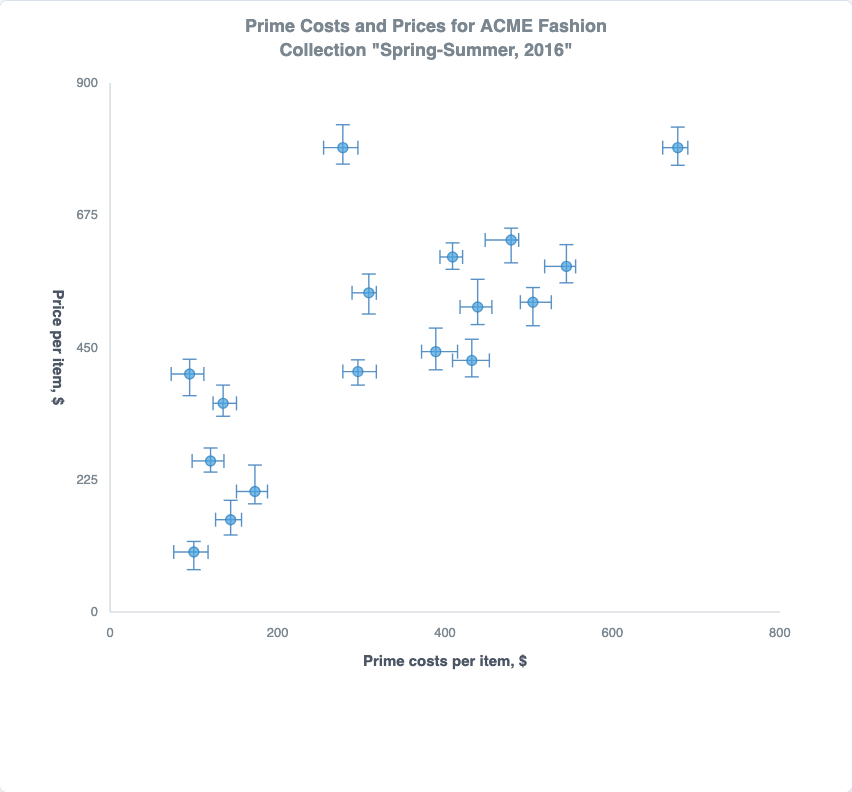

# @echarts-extension/error-chart

ECharts extension chart for drawing upper and lower error intervals on column, bar, line, and scatter charts. Import this package for side effects to register `series.type = 'errorChart'`.



## Install

```bash
npm install echarts @echarts-extension/error-chart
```

## Usage

```ts
import * as echarts from 'echarts';
import '@echarts-extension/error-chart';

const chart = echarts.init(document.getElementById('chart'));
chart.setOption({
  series: [
    {
      type: 'errorChart',
      variant: 'line',
      categoryField: 'month',
      valueField: 'duration',
      lowField: 'low',
      highField: 'high',
      data: [
        { month: 'Jan', duration: 28, low: 18, high: 40 },
        { month: 'Feb', duration: 54, lowerError: 10, upperError: 8 },
        { month: 'Mar', duration: 88, low: 76, high: 100 }
      ]
    }
  ]
});
```

Scatter variants can draw horizontal and vertical error bars on two numeric axes:

```ts
chart.setOption({
  title: {
    text: 'Prime Costs and Prices for ACME Fashion\nCollection "Spring-Summer, 2016"'
  },
  series: [
    {
      type: 'errorChart',
      variant: 'scatter',
      xField: 'cost',
      yField: 'price',
      xLowField: 'costLow',
      xHighField: 'costHigh',
      yLowField: 'priceLow',
      yHighField: 'priceHigh',
      data: [
        { name: 'A', cost: 120, price: 250, costLow: 105, costHigh: 132, priceLow: 220, priceHigh: 280 }
      ]
    }
  ]
});
```

## Options

<!-- OPTIONS:START -->
This table is generated by `scripts/sync-options-from-readmes.mjs --write-readmes`. Update the README option table, then run `npm run docs:sync-options` to refresh the static docs page.

| Option | Description | Values |
| --- | --- | --- |
| `type` | Registers this package series with ECharts. | `'errorChart'` |
| `variant` | Chooses the mark shape used with the error intervals. | `'column' \| 'bar' \| 'line' \| 'scatter'` |
| `data` | Error chart rows. Category variants read category, value, low/high or lowerError/upperError. Scatter variants also read x and x error fields. | `Array<Object \| Array>` |
| `categoryField` | Field or array index used as the category for column, bar, and line variants. | `string \| number` |
| `valueField` | Field or array index used as the measured value for category variants. | `string \| number` |
| `lowField` | Absolute lower bound field for category variants, or the y lower bound fallback for scatter variants. | `string \| number` |
| `highField` | Absolute upper bound field for category variants, or the y upper bound fallback for scatter variants. | `string \| number` |
| `lowerErrorField` | Relative lower error magnitude. Used when no absolute lower bound is present. | `string \| number` |
| `upperErrorField` | Relative upper error magnitude. Used when no absolute upper bound is present. | `string \| number` |
| `xField` | Numeric x field for scatter variants. | `string \| number` |
| `yField` | Numeric y field for scatter variants. | `string \| number` |
| `xLowField` | Absolute x lower bound for scatter variants. | `string \| number` |
| `xHighField` | Absolute x upper bound for scatter variants. | `string \| number` |
| `xMinusField` | Relative x lower error magnitude. | `string \| number` |
| `xPlusField` | Relative x upper error magnitude. | `string \| number` |
| `yLowField` | Absolute y lower bound for scatter variants. | `string \| number` |
| `yHighField` | Absolute y upper bound for scatter variants. | `string \| number` |
| `categories` | Explicit category order for category variants. | `Array<string \| number>` |
| `padding` | Inner plot padding. | `number \| { top, right, bottom, left }` |
| `min` | Lower bound for the value or y axis. | `number` |
| `max` | Upper bound for the value or y axis. | `number` |
| `xMin` | Lower bound for the scatter x axis. | `number` |
| `xMax` | Upper bound for the scatter x axis. | `number` |
| `baseline` | Baseline used by column and bar variants. | `number` |
| `tickCount` | Number of generated value ticks. | `number` |
| `barWidth` | Width of column bars or height of horizontal bars. | `number` |
| `capWidth` | Width of error bar caps. | `number` |
| `symbolSize` | Circle size for line and scatter variants. | `number` |
| `valueAxis` | Styles the value axis, labels, split lines, and axis name. | `Object` |
| `xAxis` | Styles the numeric x axis for scatter variants. | `Object` |
| `categoryAxis` | Styles category labels. | `Object` |
| `lineStyle` | Styles the line variant connector. | `Object` |
| `errorBarStyle` | Styles error interval lines and caps. | `Object` |
| `itemStyle` | Styles bars and point symbols. | `Object` |
| `label` | Optional value labels. Supports `{b}`, `{c}`, `{category}`, `{lower}`, and `{upper}` string tokens. | `Object` |
<!-- OPTIONS:END -->
