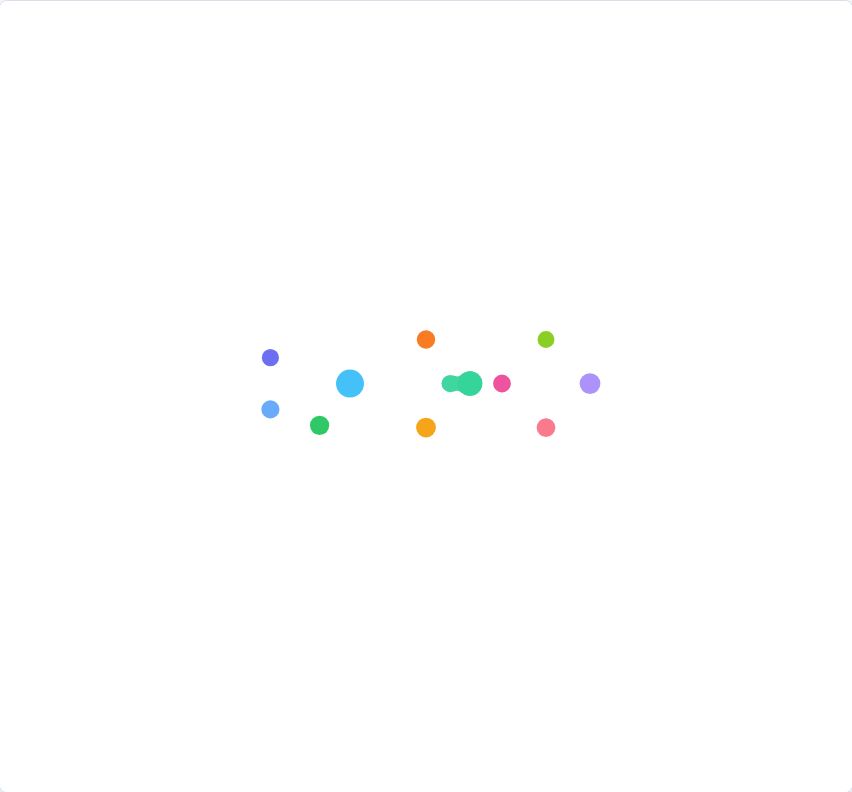

# @echarts-extension/evolution-fluid

语言：[English](./README.md) | 中文

ECharts 事件驱动的实体散点演化图扩展。导入本包即可注册 `series.type = 'evolutionFluid'`。



## 安装

```bash
npm install echarts @echarts-extension/evolution-fluid
```

## 基础用法

```js
import * as echarts from 'echarts';
import '@echarts-extension/evolution-fluid';

const chart = echarts.init(document.getElementById('main'));

chart.setOption({
  series: [
    {
      type: 'evolutionFluid',
      entities: [
        { id: 'alpha', name: 'Alpha AI', industry: 'AI', value: 120 },
        { id: 'beta', name: 'Beta Cloud', industry: 'Cloud', value: 80 },
        { id: 'media', name: 'Media Lab', industry: 'Media', value: 42 }
      ],
      events: [
        { time: '2019', type: 'found', targets: ['alpha'], value: 120 },
        { time: '2021', type: 'acquire', sources: ['beta'], targets: ['alpha'], value: 45 },
        { time: '2024', type: 'spinOff', sources: ['alpha'], targets: ['media'], value: 20 }
      ],
      currentTime: '2024',
      dropletStyle: {
        bridgeThreshold: 240,
        bridgeOpacity: 0.78
      }
    }
  ]
});
```

## 数据

`entities` 描述长期存在的实体点，例如公司、行业或业务单元。每一个渲染出来的散点就是一个实体。`events` 描述这些实体点如何靠近、合并、吞并、拆分、改名、关闭或建立关系。

- `found` 表示实体点出现。
- `acquire` 和 `merge` 会绘制源实体到目标实体的融合桥。
- `split` 和 `spinOff` 会绘制分离关系。
- 自定义事件类型复用 `sources` 和 `targets`，以通用实体点转移方式绘制。
- 事件引用了不存在的实体时，会自动生成占位点，方便先画出不完整的演化故事。

### 实验性流体模拟

设置 `fluidSimulation.enabled: true` 后，收购、合并、拆分、spin-off 会走确定性的隐式曲面运行时。当前默认仍保留旧渲染路径，等视觉效果稳定后再切换默认值。

## 配置项

<!-- OPTIONS:START -->
此表由 `scripts/sync-options-from-readmes.mjs --write-readmes` 生成。更新 README 的配置表后，运行 `npm run docs:sync-options` 可刷新静态文档页。

| 配置项 | 说明 | 可选值 |
| --- | --- | --- |
| `type` | 向 ECharts 注册该包的系列类型。 | `'evolutionFluid'` |
| `silent` | 为 true 时禁用系列鼠标事件。 | `布尔值` |
| `width` | 系列区域宽度。 | `数字 \| 字符串 (像素或百分比)` |
| `height` | 系列区域高度。 | `数字 \| 字符串 (像素或百分比)` |
| `top` | 距离图表容器顶部的距离。 | `数字 \| 字符串 (像素或百分比)` |
| `right` | 距离图表容器右侧的距离。 | `数字 \| 字符串 (像素或百分比)` |
| `bottom` | 距离图表容器底部的距离。 | `数字 \| 字符串 (像素或百分比)` |
| `left` | 距离图表容器左侧的距离。 | `数字 \| 字符串 (像素或百分比)` |
| `entities` | 长期存在的实体点，例如公司、行业或业务单元。 | `数组<对象>` |
| `entities.id` | 事件引用的实体 ID。 | `字符串 \| 数字` |
| `entities.name` | 显示名称。 | `字符串 \| 数字` |
| `entities.value` | 当前实体规模，用于计算水滴半径。 | `数字 \| 字符串` |
| `entities.industry` | 默认聚类使用的分类。 | `字符串 \| 数字` |
| `events` | 驱动水滴融合和拆分的事件时间线。 | `数组<对象>` |
| `events.time` | 事件时间或离散步骤。 | `字符串 \| 数字 \| Date` |
| `events.type` | 事件类型。 | `'found' \| 'acquire' \| 'merge' \| 'split' \| 'spinOff' \| 'rename' \| 'close' \| 字符串` |
| `events.sources` | 源实体 ID。 | `数组<字符串 \| 数字>` |
| `events.targets` | 目标实体 ID。 | `数组<字符串 \| 数字>` |
| `events.value` | 事件规模，用于转场和融合桥强度。 | `数字 \| 字符串` |
| `currentTime` | 当前播放时间。 | `字符串 \| 数字 \| Date \| null` |
| `fluidSimulation.enabled` | 将结构性事件交给实验性的确定性隐式曲面运行时绘制。 | `布尔值` |
| `fluidSimulation.mode` | 流体运行时模式。 | `'implicit' \| 'physical'` |
| `fluidSimulation.quality` | 曲面采样质量。 | `'fast' \| 'balanced' \| 'smooth'` |
| `fluidSimulation.areaConservation` | 源实体缩入目标时保持水滴面积守恒。 | `布尔值` |
| `surface.enabled` | 为 true 时使用 zrender waterdrop surface 示例的运动模型。 | `布尔值` |
| `surface.seed` | surface 模式下确定性的目标吞并顺序。 | `数字` |
| `surface.bridgeLength` | surface 模式下水滴颈部开始连接的距离。 | `数字` |
| `surface.color` | surface 水滴填充颜色。 | `字符串` |
| `autoplay` | 在 demo 或外部控制器中默认启用播放。 | `布尔值` |
| `playSpeed` | 外部控制器使用的播放速度倍数。 | `数字` |
| `layout.clustering` | 布局聚类模式。 | `'category' \| 'none' \| 字符串` |
| `layout.categoryGap` | 分类聚类之间的间距。 | `数字` |
| `dropletStyle.minRadius` | 最小实体点半径。 | `数字` |
| `dropletStyle.maxRadius` | 最大实体点半径。 | `数字` |
| `dropletStyle.bridgeOpacity` | 融合桥最大透明度。 | `数字` |
| `dropletStyle.bridgeThreshold` | 强融合桥的推荐最大距离。 | `数字` |
| `dropletStyle.bridgeColor` | 融合桥填充颜色。 | `字符串` |
| `timeline.show` | 为 true 时显示内部时间线。 | `布尔值` |
| `label.show` | 为 true 时显示实体标签。 | `布尔值` |
| `bookmark.data` | 演示书签元数据。 | `数组<对象>` |
<!-- OPTIONS:END -->
