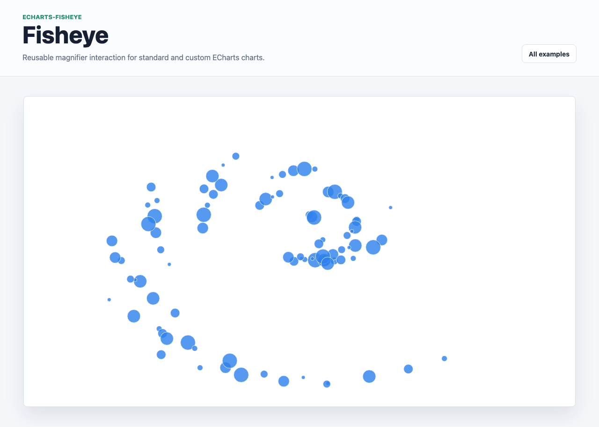

# @echarts-extension/fisheye

语言：[English](./README.md) | 中文

ECharts 可复用鱼眼放大交互组件。导入一次后，可在任意图表中添加顶层 `fisheye` 选项。



```js
import * as echarts from 'echarts';
import '@echarts-extension/fisheye';

const chart = echarts.init(document.getElementById('main'));
chart.setOption({
  fisheye: {
    show: true,
    radius: 140,
    scale: 2.4
  },
  xAxis: {},
  yAxis: {},
  series: [
    {
      type: 'scatter',
      data: [[1, 2], [2, 3], [3, 1]]
    }
  ]
});
```

组件会监听图表的 zrender 指针事件，并对指针附近的显示元素应用临时放大镜变换。设置 `show: false` 或移除组件即可关闭。
