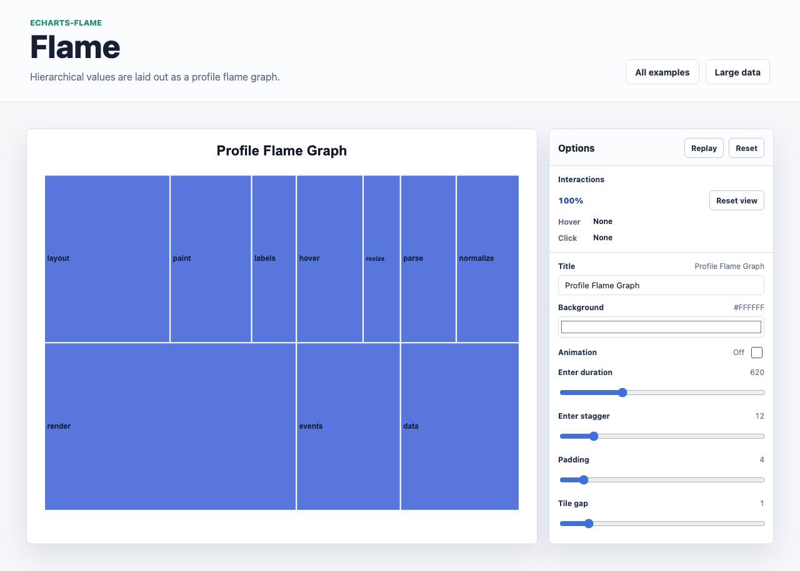

# @echarts-extension/flame

语言：[English](./README.md) | 中文

ECharts 层级火焰图扩展。导入本包即可注册 `series.type = 'flame'`。



## 安装

```bash
npm install echarts @echarts-extension/flame
```

## 基础用法

```js
import * as echarts from 'echarts';
import '@echarts-extension/flame';

const chart = echarts.init(document.getElementById('main'));

chart.setOption({
  series: [
    {
      type: 'flame',
      data: {
        name: 'root',
        children: [
          { name: 'render', value: 30, children: [{ name: 'diff', value: 18 }, { name: 'patch', value: 12 }] },
          { name: 'commit', value: 20 }
        ]
      },
      orient: 'up',
      rootVisible: false,
      gap: 1,
      label: { show: true, formatter: '{b}' }
    }
  ]
});
```

## 数据

使用一个根对象或根对象数组：

- 节点使用 `name`，并可选使用 `value` 和 `children`。
- 父节点省略 `value` 时，会根据子节点推断。
- 如果父节点数值大于子节点总和，额外数值会绘制为自身耗时。
- 设置 `rootVisible: false` 可隐藏根框。

## 常用选项

- `orient`：`up` 将子节点绘制在父节点上方，`down` 将子节点绘制在下方。
- `padding` and `gap`：框架间距。
- `rootName`, `rootVisible`：根节点行为。
- `sort`：`value`, `name`, `none`, `true`, or `false`.
- `colors`, `itemStyle`, `label`, `emphasis`：展示样式。
