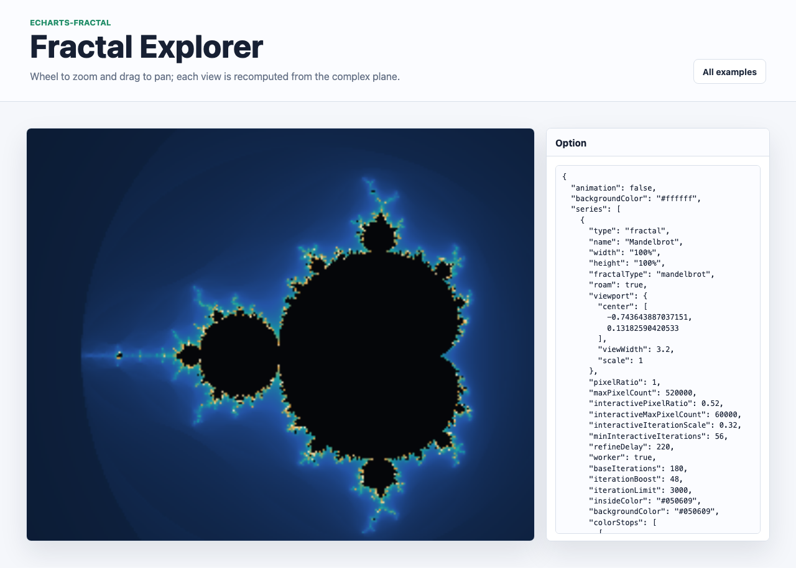

# @echarts-extension/fractal

Language: English | [中文](./README_CN.md)

ECharts extension chart for zoomable fractal rendering. Import this package for side effects to register `series.type = 'fractal'`.



## Install

```bash
npm install echarts @echarts-extension/fractal
```

## Basic Usage

```js
import * as echarts from 'echarts';
import '@echarts-extension/fractal';

const chart = echarts.init(document.getElementById('main'));

chart.setOption({
  series: [
    {
      type: 'fractal',
      fractalType: 'mandelbrot',
      roam: true,
      viewport: {
        center: [-0.743643887037151, 0.13182590420533],
        viewWidth: 3.2,
        scale: 1
      },
      baseIterations: 180,
      iterationBoost: 42,
      iterationLimit: 2400,
      maxPixelCount: 420000
    }
  ]
});
```

## Zooming Detail

The renderer does not scale a fixed bitmap. Wheel zoom and drag pan update the complex-plane viewport and recompute the fractal at the current display resolution. During interaction it first transforms the previous image for immediate visual feedback, renders a bounded preview on the main thread, then sends the full-resolution refinement to a cancellable Web Worker. `scale` has no built-in upper cap when `maxZoom` is `null`, so zooming can continue until normal floating-point precision or the configured iteration budget becomes the limiting factor.

Useful controls:

- `viewport.center`, `viewport.viewWidth`, `viewport.scale`: initial complex-plane camera.
- `roam`: enables wheel zoom and drag pan.
- `baseIterations`, `iterationBoost`, `iterationLimit`: increase escape iterations as zoom grows.
- `pixelRatio`, `maxPixelCount`: control render density and performance.
- `interactivePixelRatio`, `interactiveMaxPixelCount`, `interactiveIterationScale`, `refineDelay`: keep wheel zoom and drag pan responsive, then refine the image after interaction pauses.
- `worker`: enabled by default for final high-detail renders; set `false` to force the old synchronous path.
- `workerUrl`: optional self-hosted worker script URL for deployments that disallow inline Blob workers.
- `fractalType`: `mandelbrot`, `julia`, or `burningShip`.
- `juliaConstant`: complex constant for Julia sets.
- `insideColor`, `backgroundColor`, `colorStops`: palette controls.
