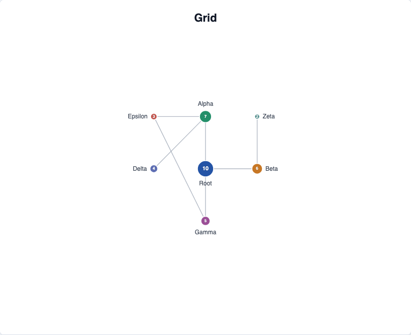

# @echarts-extension/grid

语言：[English](./README.md) | 中文

ECharts 确定性网格图布局扩展。导入本包即可注册 `series.type = 'grid'`。



## 安装

```bash
npm install echarts @echarts-extension/grid
```

## 基础用法

```js
import * as echarts from 'echarts';
import '@echarts-extension/grid';

const chart = echarts.init(document.getElementById('main'));

chart.setOption({
  series: [
    {
      type: 'grid',
      data: [
        { id: 'a', cluster: 'core', value: 8 },
        { id: 'b', cluster: 'core', value: 5 },
        { id: 'c', cluster: 'edge', value: 4 },
        { id: 'd', cluster: 'edge', value: 3 }
      ],
      links: [
        { source: 'a', target: 'b' },
        { source: 'a', target: 'c' }
      ],
      label: { show: true },
      layout: {
        cols: 2,
        preventOverlap: true,
        nodeSpacing: 10,
        sortBy: 'cluster'
      }
    }
  ]
});
```

## 数据

使用 ECharts 图关系风格输入：

- `data` 或 `nodes` 表示节点。
- `links` 或 `edges` 表示连接。
- 每条连线使用 `source` 和 `target`，对应节点的 `id` 或 `name`。
- 省略 `symbolSize` 时，会根据数值型 `value` 推断节点大小。

## 常用选项

- `layout.rows` and `layout.cols`：控制网格形状。
- `layout.begin`：第一个单元格的起点。
- `layout.condense`：显式位置稀疏时填充空单元格。
- `layout.position`：为节点返回 `{ row, col }` 的函数。
- `layout.sortBy`：字段名或函数。字段名可以读取嵌套数据，例如 `data.cluster`。
- `layout.preventOverlap` and `layout.nodeSpacing`：保持相邻单元格可读。
