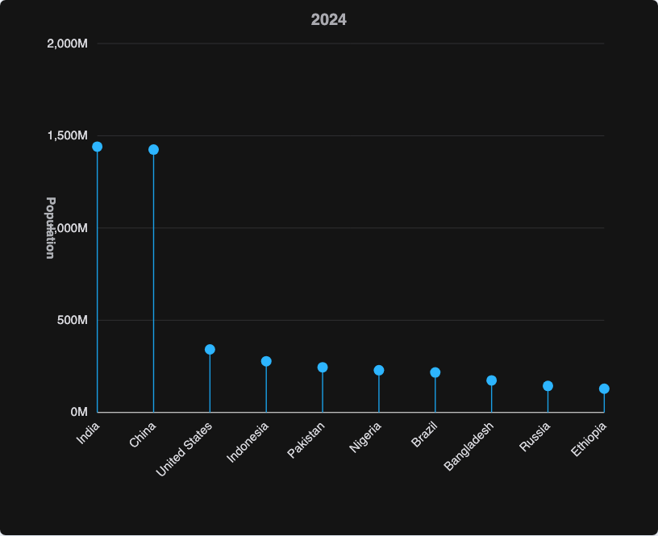

# @echarts-extension/lollipop

语言：[English](./README.md) | 中文

ECharts 棒棒糖图扩展。导入本包即可注册 `series.type = 'lollipop'`。



## 安装

```bash
npm install echarts @echarts-extension/lollipop
```

## 基础用法

```js
import * as echarts from 'echarts';
import '@echarts-extension/lollipop';

const chart = echarts.init(document.getElementById('main'));

chart.setOption({
  series: [
    {
      type: 'lollipop',
      data: [
        { country: 'India', population: 1441 },
        { country: 'China', population: 1425 },
        { country: 'United States', population: 342 },
        { country: 'Indonesia', population: 278 }
      ],
      categoryField: 'country',
      valueField: 'population',
      baseline: 0,
      min: 0,
      max: 1600,
      symbolSize: 12,
      label: { show: true }
    }
  ]
});
```

## 数据

可以使用对象或数组行：

- 对象行读取 `categoryField`、`valueField`，以及可选的 `nameField`。
- 数组行可以配合 `dimensions`，例如 `dimensions: ['country', 'population']`。
- 数值会从基线绘制到图形标记。

## 常用选项

- `categoryField`, `valueField`, `nameField`：映射数据字段。
- `categories`：显式分类顺序。
- `baseline`：茎线起始值。
- `min`, `max`, `tickCount`, `nice`：数值轴设置。
- `symbolSize`：棒棒糖端点直径。
- `stemStyle`, `itemStyle`, `label`, `valueAxis`, `categoryAxis`, `grid`：展示样式。
