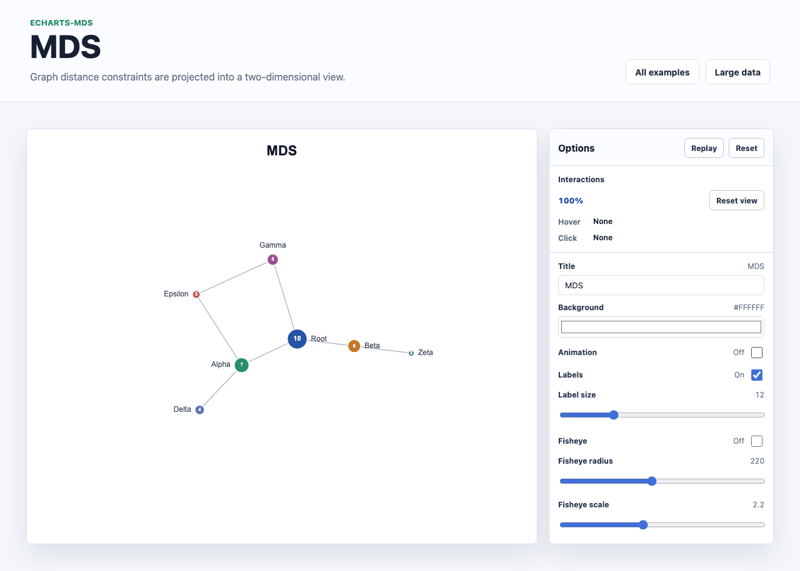

# @echarts-extension/mds

语言：[English](./README.md) | 中文

ECharts 自定义多维缩放图布局扩展。导入本包即可注册 `series.type = 'mds'`。



## 安装

```bash
npm install echarts @echarts-extension/mds
```

## 基础用法

```js
import * as echarts from 'echarts';
import '@echarts-extension/mds';

const chart = echarts.init(document.getElementById('main'));

chart.setOption({
  series: [
    {
      type: 'mds',
      data: [
        { id: 'alpha', value: 10 },
        { id: 'beta', value: 8 },
        { id: 'gamma', value: 6 },
        { id: 'delta', value: 4 }
      ],
      links: [
        { source: 'alpha', target: 'beta' },
        { source: 'beta', target: 'gamma' },
        { source: 'gamma', target: 'delta' }
      ],
      label: { show: true },
      layout: {
        linkDistance: 120,
        maxIteration: 300,
        preventOverlap: true
      }
    }
  ]
});
```

## 数据

使用 ECharts 图关系风格输入：

- `data` 或 `nodes` 表示节点。
- `links` 或 `edges` 表示连接。
- 每条连线使用 `source` 和 `target`，对应节点的 `id` 或 `name`。
- 省略 `symbolSize` 时，会根据数值型 `value` 推断节点大小。

## 常用选项

- `layout.linkDistance`：MDS 求解器使用的目标图距离。
- `layout.maxIteration`：求解器迭代上限。
- `layout.center`：最终布局的中心点。
- `layout.preventOverlap`：求解后将节点轻微分开。
- `layout.preventOverlapPadding`：防重叠使用的额外间距。
