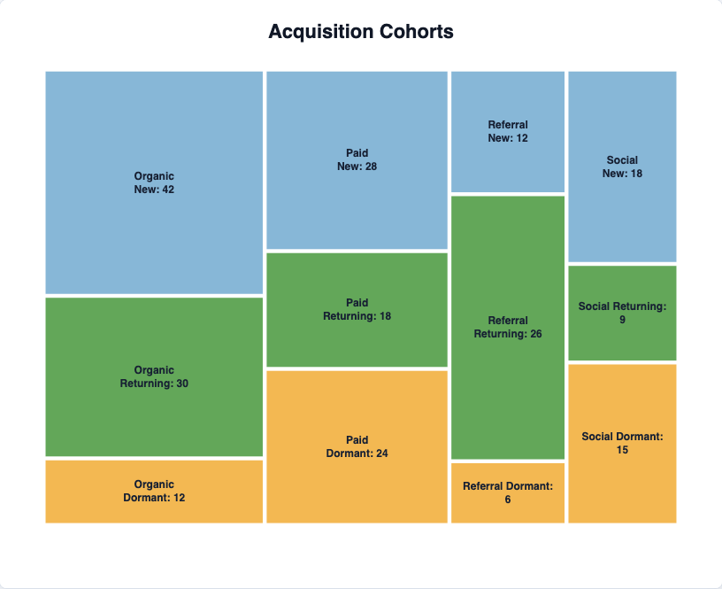

# @echarts-extension/mosaic

Language: English | [中文](./README_CN.md)

ECharts extension chart for categorical mosaic plots. Import this package for side effects to register `series.type = 'mosaic'`.



## Install

```bash
npm install echarts @echarts-extension/mosaic
```

## Basic Usage

```js
import * as echarts from 'echarts';
import '@echarts-extension/mosaic';

const chart = echarts.init(document.getElementById('main'));

chart.setOption({
  series: [
    {
      type: 'mosaic',
      xField: 'device',
      yField: 'browser',
      valueField: 'users',
      data: [
        { device: 'Desktop', browser: 'Chrome', users: 50 },
        { device: 'Desktop', browser: 'Safari', users: 10 },
        { device: 'Mobile', browser: 'Chrome', users: 35 },
        { device: 'Mobile', browser: 'Safari', users: 30 }
      ],
      gap: 2,
      label: {
        show: true,
        formatter: '{x}\n{y}: {c}'
      }
    }
  ]
});
```

## Data

Use objects or array rows:

- `xField` controls column groups.
- `yField` controls vertical splits inside each column.
- `valueField` controls area.
- Use `xCategories` and `yCategories` to force category order.
- Set `dimensions` when using array rows.

## Options

<!-- OPTIONS:START -->
This table is generated by `scripts/sync-options-from-readmes.mjs --write-readmes`. Update the English README option table, then run `npm run docs:sync-options` to refresh the docs page.

| Option | Description | Values |
| --- | --- | --- |
| `type` | Registers this package series with ECharts. | `'mosaic'` |
| `silent` | Disables mouse events for the series when true. | `boolean` |
| `width` | Series box width. | `number \| string (pixel or percent)` |
| `height` | Series box height. | `number \| string (pixel or percent)` |
| `top` | Distance from the top of the chart container. | `number \| string (pixel or percent)` |
| `right` | Distance from the right of the chart container. | `number \| string (pixel or percent)` |
| `bottom` | Distance from the bottom of the chart container. | `number \| string (pixel or percent)` |
| `left` | Distance from the left of the chart container. | `number \| string (pixel or percent)` |
| `data` | Records grouped by x category, y category, and value. | `Array<object \| unknown[]>` |
| `data.x` | X coordinate or category. | `number` |
| `data.y` | Y coordinate or category. | `number` |
| `data.value` | Numeric value. | `number` |
| `dimensions` | Names tuple columns when data rows are arrays. | `string[]` |
| `xField` | Field used for top-level columns. | `string \| number` |
| `yField` | Field used for segments inside each column. | `string \| number` |
| `valueField` | Field used for segment size. | `string \| number` |
| `xCategories` | Explicit order for x categories. | `Array<string \| number>` |
| `yCategories` | Explicit order for y categories. | `Array<string \| number>` |
| `padding` | Inset around the mosaic chart. | `number` |
| `gap` | Gap between mosaic cells. | `number` |
| `sort` | Sorts categories or segments. | `boolean \| 'none' \| 'value' \| 'name'` |
| `colors` | Palette used for segments. | `string[]` |
| `itemStyle` | Styles mosaic cells. | `Object` |
| `itemStyle.color` | Primary color. | `string` |
| `itemStyle.opacity` | Opacity. | `number` |
| `itemStyle.borderColor` | Border color. | `string` |
| `itemStyle.borderWidth` | Border width. | `number` |
| `itemStyle.shadowBlur` | Shadow blur radius. | `number` |
| `itemStyle.shadowColor` | Shadow color. | `string` |
| `label` | Styles cell labels. | `Object` |
| `label.show` | Shows labels when true. | `boolean` |
| `label.color` | Label text color. | `string` |
| `label.fontSize` | Label text size. | `number` |
| `label.fontWeight` | Label font weight. | `string \| number` |
| `label.formatter` | Formats label text. | `string \| function` |
| `label.lineHeight` | Label line height. | `number` |
| `emphasis` | Styles cells while hovered. | `Object` |
| `emphasis.itemStyle` | Nested item style option. | `object` |
| `emphasis.itemStyle.color` | Fill color. | `string` |
| `emphasis.itemStyle.fill` | Alias for fill color. | `string` |
| `emphasis.itemStyle.opacity` | Fill opacity. | `number` |
| `emphasis.itemStyle.borderColor` | Border color. | `string` |
| `emphasis.itemStyle.borderWidth` | Border width. | `number` |
| `emphasis.itemStyle.borderRadius` | Corner radius. | `number` |
| `emphasis.itemStyle.shadowBlur` | Shadow blur radius. | `number` |
| `emphasis.itemStyle.shadowColor` | Shadow color. | `string` |
| `emphasis.itemStyle.lineWidth` | Stroke width used by icon or shape styles. | `number` |
| `emphasis.edgeStyle` | Nested edgeStyle option. | `object` |
| `emphasis.edgeStyle.color` | Fill color. | `string` |
| `emphasis.edgeStyle.fill` | Alias for fill color. | `string` |
| `emphasis.edgeStyle.opacity` | Fill opacity. | `number` |
| `emphasis.edgeStyle.borderColor` | Border color. | `string` |
| `emphasis.edgeStyle.borderWidth` | Border width. | `number` |
| `emphasis.edgeStyle.borderRadius` | Corner radius. | `number` |
| `emphasis.edgeStyle.shadowBlur` | Shadow blur radius. | `number` |
| `emphasis.edgeStyle.shadowColor` | Shadow color. | `string` |
| `emphasis.edgeStyle.lineWidth` | Stroke width used by icon or shape styles. | `number` |
| `emphasis.focus` | Nested focus option. | `string` |
| `emphasis.blurScope` | Nested blurScope option. | `string` |
<!-- OPTIONS:END -->
