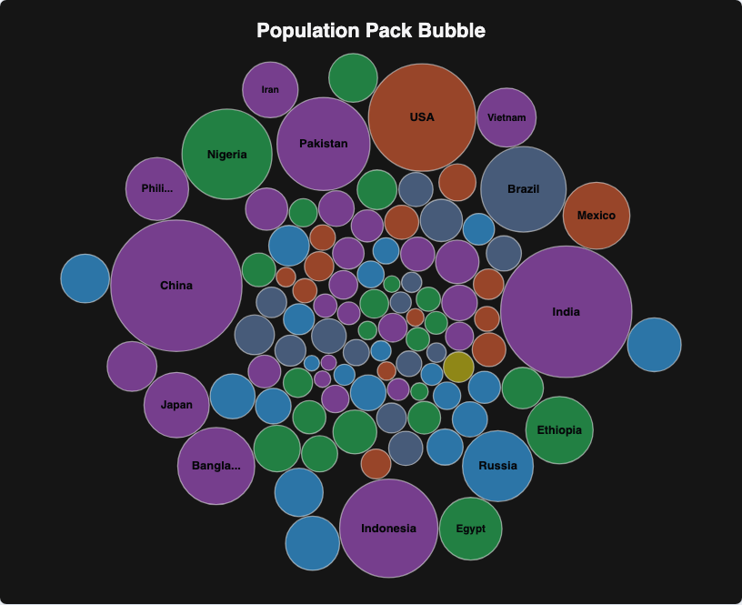

# @echarts-extension/pack-bubble

语言：[English](./README.md) | 中文

ECharts 平面气泡堆积图扩展。导入本包即可注册 `series.type = 'packBubble'`。



## 安装

```bash
npm install echarts @echarts-extension/pack-bubble
```

## 基础用法

```js
import * as echarts from 'echarts';
import '@echarts-extension/pack-bubble';

const chart = echarts.init(document.getElementById('main'));

chart.setOption({
  series: [
    {
      type: 'packBubble',
      data: [
        { name: 'China', value: 1412, region: 'Asia' },
        { name: 'India', value: 1408, region: 'Asia' },
        { name: 'USA', value: 335, region: 'North America' },
        { name: 'Indonesia', value: 281, region: 'Asia' }
      ],
      categoryField: 'region',
      gap: 2,
      maxRadius: 76,
      fillRatio: 0.72,
      label: { show: true, minRadius: 28 }
    }
  ]
});
```

## 数据

使用对象数组：

- `valueField` 默认读取 `value`，并控制圆半径。
- `nameField` 默认读取 `name`，并控制标签。
- 提供 `categoryField` 时会按分类分组颜色。
- 使用数据项级 `itemStyle` 或 `label` 可覆盖单个气泡样式。

## 常用选项

- `padding`, `gap`, `center`：布局间距。
- `minRadius`, `maxRadius`, `fillRatio`：气泡大小与堆积密度。
- `sort`：`asc`, `desc`, `none`, `true`, or `false`.
- `colors`, `itemStyle`, `label`, `emphasis`, `enterAnimation`：展示样式。
- `layout` 或 `layoutOptions` 可以承载相同的布局设置。

## 配置项

<!-- OPTIONS:START -->
此表由 `scripts/sync-options-from-readmes.mjs --write-readmes` 生成。更新英文 README 的配置表后，运行 `npm run docs:sync-options` 可刷新文档页。

| 配置项 | 说明 | 可选值 |
| --- | --- | --- |
| `type` | 向 ECharts 注册该包的系列类型。 | `'packBubble'` |
| `silent` | 为 true 时禁用mouse events for the 系列。 | `布尔值` |
| `width` | 系列区域宽度。 | `数字 \| 字符串 (像素或百分比)` |
| `height` | 系列区域高度。 | `数字 \| 字符串 (像素或百分比)` |
| `top` | 距离图表容器顶部的距离。 | `数字 \| 字符串 (像素或百分比)` |
| `right` | 距离图表容器右侧的距离。 | `数字 \| 字符串 (像素或百分比)` |
| `bottom` | 距离图表容器底部的距离。 | `数字 \| 字符串 (像素或百分比)` |
| `left` | 距离图表容器左侧的距离。 | `数字 \| 字符串 (像素或百分比)` |
| `data` | Flat bubble 记录 with 数值 and 可选 分类 字段。 | `数组<对象>` |
| `data.value` | 数值。 | `数字` |
| `data.name` | 显示名称。 | `字符串 \| 数字` |
| `data.category` | 分类名称或 ID。 | `字符串 \| 数字` |
| `layout` | Nested 布局 options for the bubble packing engine。 | `对象` |
| `layout.padding` | 内边距 around the packed bubbles。 | `数字 \| 对象` |
| `layout.padding.top` | 顶部内边距。 | `数字` |
| `layout.padding.right` | 右侧内边距。 | `数字` |
| `layout.padding.bottom` | 底部内边距。 | `数字` |
| `layout.padding.left` | 左侧内边距。 | `数字` |
| `layout.gap` | Space between packed bubbles。 | `数字` |
| `layout.fast` | 使用fast 布局 path。 | `布尔值` |
| `layout.fastThreshold` | 项 count threshold for the fast 布局 path。 | `数字` |
| `layout.minRadius` | Smallest bubble 半径。 | `数字` |
| `layout.maxRadius` | Largest bubble 半径。 | `数字` |
| `layout.fillRatio` | How densely bubbles fill the available area。 | `数字` |
| `layout.center` | 中心点 点 for the 布局。 | `[数字 \| 字符串, 数字 \| 字符串]` |
| `layout.sort` | 对bubbles before 布局排序。 | `布尔值 \| 'asc' \| 'desc' \| 'none'` |
| `layoutOptions` | nested 布局 options的别名。 | `对象` |
| `layoutOptions.padding` | 内边距 around the packed bubbles。 | `数字 \| 对象` |
| `layoutOptions.padding.top` | 顶部内边距。 | `数字` |
| `layoutOptions.padding.right` | 右侧内边距。 | `数字` |
| `layoutOptions.padding.bottom` | 底部内边距。 | `数字` |
| `layoutOptions.padding.left` | 左侧内边距。 | `数字` |
| `layoutOptions.gap` | Space between packed bubbles。 | `数字` |
| `layoutOptions.fast` | 使用fast 布局 path。 | `布尔值` |
| `layoutOptions.fastThreshold` | 项 count threshold for the fast 布局 path。 | `数字` |
| `layoutOptions.minRadius` | Smallest bubble 半径。 | `数字` |
| `layoutOptions.maxRadius` | Largest bubble 半径。 | `数字` |
| `layoutOptions.fillRatio` | How densely bubbles fill the available area。 | `数字` |
| `layoutOptions.center` | 中心点 点 for the 布局。 | `[数字 \| 字符串, 数字 \| 字符串]` |
| `layoutOptions.sort` | 对bubbles before 布局排序。 | `布尔值 \| 'asc' \| 'desc' \| 'none'` |
| `padding` | 内边距 around the packed bubbles。 | `数字 \| 对象` |
| `padding.top` | 顶部内边距。 | `数字` |
| `padding.right` | 右侧内边距。 | `数字` |
| `padding.bottom` | 底部内边距。 | `数字` |
| `padding.left` | 左侧内边距。 | `数字` |
| `gap` | Space between packed bubbles。 | `数字` |
| `minRadius` | Smallest bubble 半径。 | `数字` |
| `maxRadius` | Largest bubble 半径。 | `数字` |
| `fillRatio` | How densely bubbles fill the available area。 | `数字` |
| `center` | 中心点 点 for the packed bubble 布局。 | `[数字 \| 字符串, 数字 \| 字符串]` |
| `valueField` | 用于bubble 大小的字段。 | `字符串` |
| `nameField` | 用于标签 and 名称s的字段。 | `字符串` |
| `categoryField` | 用于颜色 grouping的字段。 | `字符串` |
| `sort` | 对bubbles before 布局排序。 | `布尔值 \| 'asc' \| 'desc' \| 'none'` |
| `colors` | 用于分类的调色板。 | `字符串[]` |
| `enterAnimation` | 为bubbles into place添加动画。 | `布尔值 \| 对象` |
| `enterAnimation.show` | 为 true 时显示动画。 | `布尔值` |
| `enterAnimation.enabled` | 为 true 时启用动画。 | `布尔值` |
| `enterAnimation.duration` | 动画时长。 | `数字 \| 函数` |
| `enterAnimation.delay` | 动画开始前的延迟。 | `数字 \| 函数` |
| `enterAnimation.stagger` | 图元之间增加的延迟。 | `数字 \| 函数` |
| `enterAnimation.easing` | 动画缓动名称。 | `字符串` |
| `itemStyle` | 设置bubbles样式。 | `对象` |
| `itemStyle.color` | 主颜色。 | `字符串` |
| `itemStyle.opacity` | 透明度。 | `数字` |
| `itemStyle.borderColor` | 边框颜色。 | `字符串` |
| `itemStyle.borderWidth` | 边框宽度。 | `数字` |
| `itemStyle.shadowBlur` | 阴影模糊半径。 | `数字` |
| `itemStyle.shadowColor` | 阴影颜色。 | `字符串` |
| `label` | 设置bubble 标签样式。 | `对象` |
| `label.show` | 为 true 时显示标签。 | `布尔值` |
| `label.color` | 标签文字颜色。 | `字符串` |
| `label.fontSize` | 标签文字大小。 | `数字` |
| `label.fontWeight` | 标签字重。 | `字符串 \| 数字` |
| `label.formatter` | 格式化标签 文本。 | `字符串 \| 函数` |
| `label.lineHeight` | 标签 线 高度。 | `数字` |
| `label.minRadius` | 最小值 半径，用于判断何时标签 is shown。 | `数字` |
| `emphasis` | 设置bubbles while 悬停时样式。 | `对象` |
| `emphasis.itemStyle` | 嵌套 项 样式 选项。 | `对象` |
| `emphasis.itemStyle.color` | 填充颜色。 | `字符串` |
| `emphasis.itemStyle.fill` | 填充颜色的别名。 | `字符串` |
| `emphasis.itemStyle.opacity` | 填充透明度。 | `数字` |
| `emphasis.itemStyle.borderColor` | 边框颜色。 | `字符串` |
| `emphasis.itemStyle.borderWidth` | 边框宽度。 | `数字` |
| `emphasis.itemStyle.borderRadius` | 圆角半径。 | `数字` |
| `emphasis.itemStyle.shadowBlur` | 阴影模糊半径。 | `数字` |
| `emphasis.itemStyle.shadowColor` | 阴影颜色。 | `字符串` |
| `emphasis.itemStyle.lineWidth` | icon or shape 样式使用的Stroke 宽度。 | `数字` |
| `emphasis.edgeStyle` | 嵌套 边tyle 选项。 | `对象` |
| `emphasis.edgeStyle.color` | 填充颜色。 | `字符串` |
| `emphasis.edgeStyle.fill` | 填充颜色的别名。 | `字符串` |
| `emphasis.edgeStyle.opacity` | 填充透明度。 | `数字` |
| `emphasis.edgeStyle.borderColor` | 边框颜色。 | `字符串` |
| `emphasis.edgeStyle.borderWidth` | 边框宽度。 | `数字` |
| `emphasis.edgeStyle.borderRadius` | 圆角半径。 | `数字` |
| `emphasis.edgeStyle.shadowBlur` | 阴影模糊半径。 | `数字` |
| `emphasis.edgeStyle.shadowColor` | 阴影颜色。 | `字符串` |
| `emphasis.edgeStyle.lineWidth` | icon or shape 样式使用的Stroke 宽度。 | `数字` |
| `emphasis.focus` | 嵌套 focus 选项。 | `字符串` |
| `emphasis.blurScope` | 嵌套 blurScope 选项。 | `字符串` |
<!-- OPTIONS:END -->
