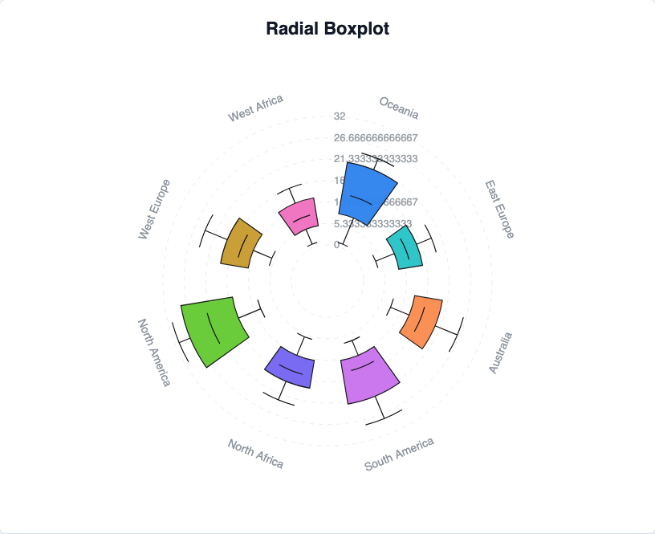

# @echarts-extension/radial-boxplot

语言：[English](./README.md) | 中文

ECharts 径向箱线图扩展。导入本包即可注册 `series.type = 'radialBoxplot'`。



## 安装

```bash
npm install echarts @echarts-extension/radial-boxplot
```

## 基础用法

```js
import * as echarts from 'echarts';
import '@echarts-extension/radial-boxplot';

const chart = echarts.init(document.getElementById('main'));

chart.setOption({
  series: [
    {
      type: 'radialBoxplot',
      categoryField: 'name',
      min: 0,
      max: 32,
      innerRadius: '18%',
      outerRadius: '82%',
      boxWidth: 0.58,
      capWidth: 0.34,
      data: [
        { name: 'Oceania', min: 1, q1: 8, median: 13, q3: 21, max: 24 },
        { name: 'East Europe', min: 4, q1: 9, median: 12, q3: 15, max: 19 },
        { name: 'Australia', min: 8, q1: 13, median: 16, q3: 20, max: 26 }
      ]
    }
  ]
});
```

## 数据

可以使用对象或数组行：

- `categoryField` 或 `nameField` 用于识别每个角度槽位。
- `minField`, `q1Field`, `medianField`, `q3Field`, and `maxField` 可映射自定义字段名。
- 默认对象字段为 `min`、`q1`、`median`、`q3` 和 `max`。
- 使用数组行时请设置 `dimensions`。

## 常用选项

- `innerRadius`, `outerRadius`, `center`, `startAngle`, `endAngle`, `clockwise`：极坐标布局设置。
- `min`, `max`, `tickCount`, `nice`：radial 数值轴设置。
- `boxWidth`, `capWidth`, `labelRadius`：mark 几何设置。
- `grid`, `radialAxis`, `angleAxis`：坐标轴和辅助线设置。
- `itemStyle`, `whiskerLineStyle`, `medianLineStyle`, `capLineStyle`：系列样式。
