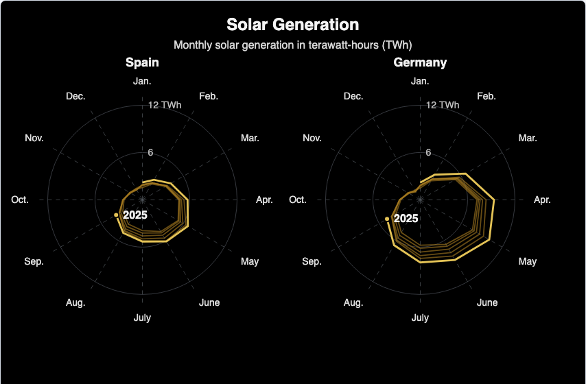

# @echarts-extension/seasonal-radial

语言：[English](./README.md) | 中文

用于季节性年轮小多图的 ECharts 扩展图表。引入此包的副作用即可注册 `series.type = 'seasonalRadial'`。



## 安装

```bash
npm install echarts @echarts-extension/seasonal-radial
```

## 基础用法

```js
import * as echarts from 'echarts';
import '@echarts-extension/seasonal-radial';

const chart = echarts.init(document.getElementById('main'));

chart.setOption({
  backgroundColor: '#000',
  series: [
    {
      type: 'seasonalRadial',
      data: [
        { country: 'Spain', year: 2025, month: 'Jan.', value: 2.2 },
        { country: 'Spain', year: 2025, month: 'Feb.', value: 3.1 },
        { country: 'Spain', year: 2025, month: 'Mar.', value: 4.4 },
        { country: 'Germany', year: 2025, month: 'Jan.', value: 2.4 },
        { country: 'Germany', year: 2025, month: 'Feb.', value: 4.1 },
        { country: 'Germany', year: 2025, month: 'Mar.', value: 7.2 }
      ],
      groupField: 'country',
      yearField: 'year',
      monthField: 'month',
      valueField: 'value',
      groups: ['Spain', 'Germany'],
      min: 0,
      max: 10,
      highlightYear: 2025
    }
  ]
});
```

## 数据

支持对象数据或数组行：

- `groupField` 将数据拆成多个径向小图面板。
- `yearField` 将记录分组成每年的季节轨迹。
- `monthField` 控制圆周上的月份顺序。使用 `months` 可以显式指定月份标签与顺序。
- `valueField` 将每个月的数值映射到半径。
- 使用数组行时，通过 `dimensions` 指定列名。

## 配置项

<!-- OPTIONS:START -->
此表由 `scripts/sync-options-from-readmes.mjs --write-readmes` 生成。更新 README 的配置表后，运行 `npm run docs:sync-options` 可刷新静态文档页。

| 配置项 | 说明 | 可选值 |
| --- | --- | --- |
| `type` | 在 ECharts 中注册此扩展系列。 | `'seasonalRadial'` |
| `silent` | 设为 true 时关闭系列鼠标事件。 | `boolean` |
| `width` | 系列盒子的宽度。 | `number \| string (pixel or percent)` |
| `height` | 系列盒子的高度。 | `number \| string (pixel or percent)` |
| `top` | 距离容器顶部的距离。 | `number \| string (pixel or percent)` |
| `right` | 距离容器右侧的距离。 | `number \| string (pixel or percent)` |
| `bottom` | 距离容器底部的距离。 | `number \| string (pixel or percent)` |
| `left` | 距离容器左侧的距离。 | `number \| string (pixel or percent)` |
| `data` | 绘制为径向年度轨迹的季节记录。 | `Array<object \| unknown[]>` |
| `data.group` | 面板分组名。 | `string \| number` |
| `data.year` | 轨迹年份或周期。 | `string \| number` |
| `data.month` | 月份标签或序号。 | `string \| number` |
| `data.value` | 径向数值。 | `number` |
| `data.name` | 显示名称。 | `string \| number` |
| `dimensions` | 为数组行命名列。 | `string[]` |
| `groupField` | 用于面板分组的字段。 | `string \| number` |
| `yearField` | 用于轨迹分组的字段。 | `string \| number` |
| `monthField` | 用于月份顺序的字段。 | `string \| number` |
| `valueField` | 用于数值的字段。 | `string \| number` |
| `nameField` | 用于点名称的字段。 | `string \| number` |
| `groups` | 显式面板顺序。 | `Array<string \| number>` |
| `months` | 圆周月份的显式顺序。 | `Array<string \| number>` |
| `padding` | 小多图外侧留白。 | `number \| object` |
| `padding.top` | 顶部留白。 | `number` |
| `padding.right` | 右侧留白。 | `number` |
| `padding.bottom` | 底部留白。 | `number` |
| `padding.left` | 左侧留白。 | `number` |
| `panelGap` | 分组面板之间的水平间距。 | `number` |
| `center` | 每个面板的中心点。 | `[number \| string, number \| string]` |
| `radius` | 内外半径。 | `[number \| string, number \| string]` |
| `innerRadius` | 数值投影的内半径。 | `number \| string (pixel or percent)` |
| `outerRadius` | 数值投影的外半径。 | `number \| string (pixel or percent)` |
| `startAngle` | 第一个月份起始角度。 | `number (degrees)` |
| `clockwise` | 为 true 时月份按顺时针排列。 | `boolean` |
| `closed` | 完整年度轨迹闭合回第一个月份。 | `boolean` |
| `min` | 手动径向轴最小值。 | `number` |
| `max` | 手动径向轴最大值。 | `number` |
| `tickCount` | 推荐径向刻度数。 | `number` |
| `nice` | 是否将径向范围规整为更易读的刻度。 | `boolean` |
| `highlightYear` | 高亮指定年份、最新年份，或关闭高亮。 | `string \| number \| 'latest' \| null \| false` |
| `enterAnimation` | 开启首次渲染的轨迹扫入、点缩放和年份标签淡入动画。 | `boolean \| { duration?, delay?, stagger?, easing?, show?, enabled? }` |
| `showSymbol` | 显示所有点符号。 | `boolean` |
| `highlightSymbol` | 在高亮轨迹标签点显示符号。 | `boolean` |
| `symbolSize` | 点符号大小。 | `number` |
| `grid` | 显示或隐藏极坐标网格。 | `Object` |
| `grid.show` | 为 true 时显示网格。 | `boolean` |
| `radialAxis` | 控制径向标签和圆环。 | `Object` |
| `radialAxis.show` | 为 true 时显示径向轴。 | `boolean` |
| `angleAxis` | 控制月份标签和辐射线。 | `Object` |
| `angleAxis.show` | 为 true 时显示角度轴。 | `boolean` |
| `lineStyle` | 年度轨迹基础样式。 | `Object` |
| `historyLineStyle` | 非高亮年度轨迹样式。 | `Object` |
| `highlightLineStyle` | 高亮年度轨迹样式。 | `Object` |
| `itemStyle` | 点符号样式。 | `Object` |
| `groupLabel` | 面板分组标签样式。 | `Object` |
| `yearLabel` | 高亮年份标签样式。 | `Object` |
<!-- OPTIONS:END -->
