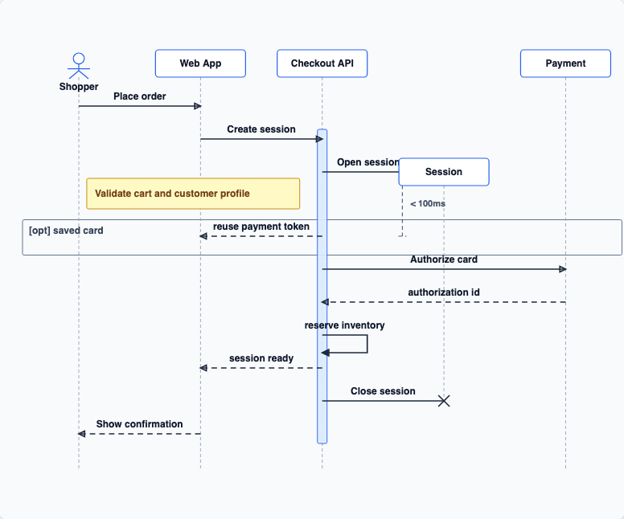

# @echarts-extension/sequence-diagram

语言：[English](./README.md) | 中文

ECharts UML 时序图扩展。



```js
import * as echarts from 'echarts';
import '@echarts-extension/sequence-diagram';

const chart = echarts.init(document.getElementById('main'));
chart.setOption({
  series: [
    {
      type: 'sequenceDiagram',
      participants: [
        { id: 'browser', name: 'Browser' },
        { id: 'api', name: 'API' },
        { id: 'db', name: 'Database' }
      ],
      messages: [
        { from: 'browser', to: 'api', text: 'GET /orders', type: 'sync' },
        { from: 'api', to: 'db', text: 'SELECT orders', type: 'async' },
        { from: 'db', to: 'api', text: 'rows', type: 'return' },
        { from: 'api', to: 'api', text: 'cache()', type: 'self' }
      ],
      activations: [
        { participant: 'api', start: 0, end: 3 }
      ]
    }
  ]
});
```

也可以通过 `dsl` 或 `source` 直接传入文本 DSL：

```js
chart.setOption({
  series: [
    {
      type: 'sequenceDiagram',
      dsl: `
        sequenceDiagram
          actor C as Client
          participant API as Order API
          create participant Session
          C->>+API: GET /orders
          API->>Session**: create session
          Note right of API: validate token
          opt cached
            API-->>-C: response
          end
          duration API,Session: < 100ms
          API-xSession: close
      `
    }
  ]
});
```

## 选项

- `participants`：可选的有序生命线。省略时会从 `messages` 或 `data` 推断参与者。
- `messages` / `data`：有序消息行或对象。对象可使用 `from`/`to` 或 `source`/`target`，以及 `text`、`name`、`message` 或 `label`。
- `dsl` / `source`：Mermaid `sequenceDiagram` 或 PlantUML `@startuml` 文本。解析器支持 participant/actor 声明、常见消息箭头、返回箭头、自调用、创建/销毁标记、备注、激活快捷写法、`alt`/`opt`/`loop`/`par` 等组合片段，以及简单的时间/持续时间约束。
- `type`：`sync`, `async`, `return`, `create`, `destroy`, or `self`.
- `activations`：使用 `{ participant, start, end, depth }` 定义激活条，其中 `start` 和 `end` 是消息索引或消息 id。
- `notes`：使用 `{ text, participant | participants, position, start, end }` 定义备注框。
- `fragments`：使用 `{ type, text, start, end, operands }` 定义组合片段框。
- `constraints`：使用 `{ type: 'timing' | 'duration', text, participants, start, end }` 定义时间点或持续时间标注。
- 布局设置：`padding`、`headerWidth`、`headerHeight`、`messageGap`、`selfLoopWidth`、`selfLoopHeight`、`activationWidth`。
