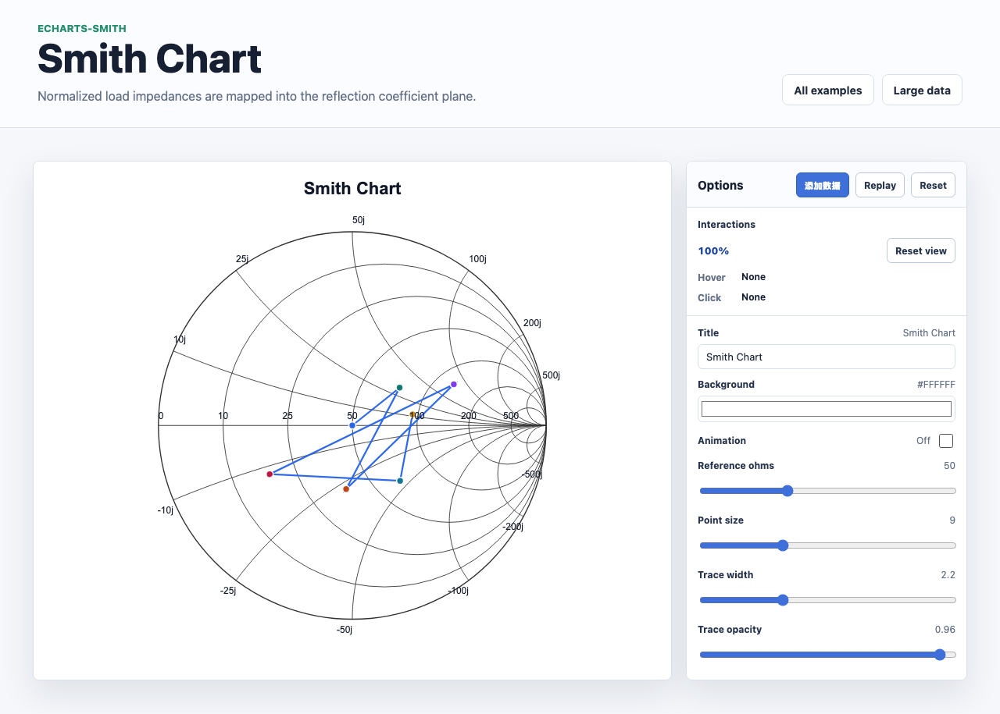

# @echarts-extension/smith

Language: English | [中文](./README_CN.md)

ECharts extension chart for Smith charts. Import this package for side effects to register `series.type = 'smith'`.



## Install

```bash
npm install echarts @echarts-extension/smith
```

## Basic Usage

```js
import * as echarts from 'echarts';
import '@echarts-extension/smith';

const chart = echarts.init(document.getElementById('main'));

chart.setOption({
  series: [
    {
      type: 'smith',
      referenceImpedance: 50,
      resistanceField: 'resistance',
      reactanceField: 'reactance',
      data: [
        { name: 'Matched', resistance: 50, reactance: 0 },
        { name: 'Inductive', resistance: 75, reactance: 25 },
        { name: 'Capacitive', resistance: 25, reactance: -20 }
      ],
      label: { show: true },
      showSwrCircle: true
    }
  ]
});
```

## Data

By default rows are read as impedance values and normalized by `referenceImpedance`.

- Object rows can use `r`/`x`, `resistance`/`reactance`, or custom fields.
- Array rows can be paired with `dimensions`.
- Set `dataType: 'gamma'` to provide reflection coefficient values through `gamma`, `gammaReal`, and `gammaImag`.

## Useful Options

- `referenceImpedance`: impedance used to normalize resistance/reactance.
- `resistanceValues`, `reactanceValues`: grid line values.
- `showSwrCircle`, `swrMagnitude`, `swrIndex`: constant-SWR circle controls.
- `grid.label.resistanceFormatter`, `grid.label.reactanceFormatter`: optional label templates such as `{ohms}` and `{ohms}j`.
- `cursor`: interactive readout for arbitrary mouse positions, including the dashed VSWR circle, constant-reactance curve, and impedance/admittance tooltip.
- `grid`, `lineStyle`, `itemStyle`, `label`, `swrStyle`: presentation controls.
