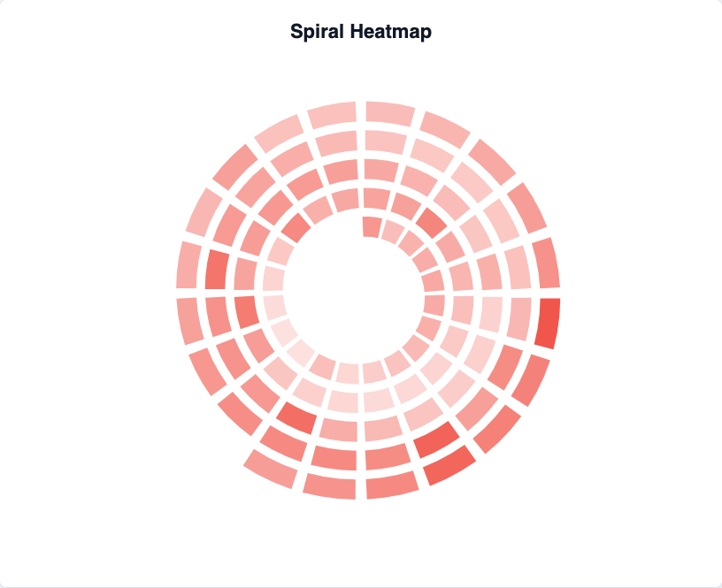

# @echarts-extension/spiral

语言：[English](./README.md) | 中文

ECharts 分段螺旋热力图扩展。导入本包即可注册 `series.type = 'spiral'`。



## 安装

```bash
npm install echarts @echarts-extension/spiral
```

## 基础用法

```js
import * as echarts from 'echarts';
import '@echarts-extension/spiral';

const chart = echarts.init(document.getElementById('main'));

chart.setOption({
  series: [
    {
      type: 'spiral',
      data: [
        { name: 'Acquire', value: 42 },
        { name: 'Activate', value: 58 },
        { name: 'Retain', value: 36 },
        { name: 'Refer', value: 24 },
        { name: 'Revenue', value: 51 }
      ],
      turns: 2,
      segmentsPerTurn: 3,
      innerRadius: 28,
      outerRadius: '84%',
      gapAngle: 3,
      label: { show: true, position: 'outside' }
    }
  ]
});
```

## 数据

可以使用对象或数组行：

- 对象行读取 `nameField` 和 `valueField`。
- 数组行可以配合 `dimensions`，例如 `dimensions: ['name', 'value']`。
- 数值控制分段颜色和透明度，并可通过 `min` 和 `max` 限定范围。

## 常用选项

- `turns`：期望的螺旋圈数。
- `segmentsPerTurn`：每圈的分段数量。
- `innerRadius`, `outerRadius`, `center`, `padding`：几何设置。
- `startAngle`, `clockwise`, `gapAngle`, `radialGap`, `bandWidth`：分段形状设置。
- `sort`：`asc`, `desc`, `none`, or `false`.
- `minOpacity`, `maxOpacity`, `itemStyle`, `label`, `enterAnimation`：展示样式。

## 配置项

<!-- OPTIONS:START -->
此表由 `scripts/sync-options-from-readmes.mjs --write-readmes` 生成。更新英文 README 的配置表后，运行 `npm run docs:sync-options` 可刷新文档页。

| 配置项 | 说明 | 可选值 |
| --- | --- | --- |
| `type` | 向 ECharts 注册该包的系列类型。 | `'spiral'` |
| `silent` | 为 true 时禁用mouse events for the 系列。 | `布尔值` |
| `width` | 系列区域宽度。 | `数字 \| 字符串 (像素或百分比)` |
| `height` | 系列区域高度。 | `数字 \| 字符串 (像素或百分比)` |
| `top` | 距离图表容器顶部的距离。 | `数字 \| 字符串 (像素或百分比)` |
| `right` | 距离图表容器右侧的距离。 | `数字 \| 字符串 (像素或百分比)` |
| `bottom` | 距离图表容器底部的距离。 | `数字 \| 字符串 (像素或百分比)` |
| `left` | 距离图表容器左侧的距离。 | `数字 \| 字符串 (像素或百分比)` |
| `data` | 记录 drawn as bands along a spiral。 | `数组<对象 \| 未知[]>` |
| `data.name` | 显示名称。 | `字符串 \| 数字` |
| `data.value` | 数值。 | `数字` |
| `dimensions` | 当数据行为数组时，用于命名 tuple 列。 | `字符串[]` |
| `nameField` | 用于标签 and 名称s的字段。 | `字符串 \| 数字` |
| `valueField` | 用于band 大小 or 颜色 scale的字段。 | `字符串 \| 数字` |
| `center` | 中心点 点 of the spiral。 | `[数字 \| 字符串, 数字 \| 字符串]` |
| `padding` | 内边距 around the spiral。 | `数字` |
| `innerRadius` | 半径 where the spiral 开始s。 | `数字 \| 字符串 (像素或百分比)` |
| `outerRadius` | 半径 where the spiral 结束s。 | `数字 \| 字符串 (像素或百分比)` |
| `turns` | Number of spiral turns。 | `数字` |
| `segmentsPerTurn` | Number of segments used per turn。 | `数字` |
| `startAngle` | 角度 where the spiral 开始s。 | `数字 (degrees)` |
| `clockwise` | 绘制spiral 顺时针。 | `布尔值` |
| `sort` | 对记录 before placement排序。 | `布尔值 \| 'none' \| 'asc' \| 'desc'` |
| `gapAngle` | 角度 间距 between segments。 | `数字` |
| `radialGap` | 径向 间距 between turns。 | `数字` |
| `bandWidth` | 宽度 of each spiral band。 | `数字` |
| `min` | 手动 scale 最小值。 | `数字` |
| `max` | 手动 scale 最大值。 | `数字` |
| `minOpacity` | 用于smallest 数值的透明度。 | `数字` |
| `maxOpacity` | 用于largest 数值的透明度。 | `数字` |
| `enterAnimation` | 为spiral bands into place添加动画。 | `布尔值 \| 对象` |
| `enterAnimation.show` | 为 true 时显示动画。 | `布尔值` |
| `enterAnimation.enabled` | 为 true 时启用动画。 | `布尔值` |
| `enterAnimation.duration` | 动画时长。 | `数字 \| 函数` |
| `enterAnimation.delay` | 动画开始前的延迟。 | `数字 \| 函数` |
| `enterAnimation.stagger` | 图元之间增加的延迟。 | `数字 \| 函数` |
| `enterAnimation.easing` | 动画缓动名称。 | `字符串` |
| `itemStyle` | 设置螺旋带样式。 | `对象` |
| `itemStyle.color` | 主颜色。 | `字符串` |
| `itemStyle.opacity` | 透明度。 | `数字` |
| `itemStyle.borderColor` | 边框颜色。 | `字符串` |
| `itemStyle.borderWidth` | 边框宽度。 | `数字` |
| `itemStyle.shadowBlur` | 阴影模糊半径。 | `数字` |
| `itemStyle.shadowColor` | 阴影颜色。 | `字符串` |
| `label` | 设置band 标签 and controls insIDe/outsIDe placement样式。 | `对象` |
| `label.show` | 为 true 时显示标签。 | `布尔值` |
| `label.position` | 标签位置。 | `字符串` |
| `label.color` | 标签文字颜色。 | `字符串` |
| `label.fontSize` | 标签文字大小。 | `数字` |
| `label.fontWeight` | 标签字重。 | `字符串 \| 数字` |
| `label.formatter` | 格式化标签 文本。 | `字符串 \| 函数` |
| `emphasis` | 设置bands while 悬停时样式。 | `对象` |
| `emphasis.itemStyle` | 嵌套 项 样式 选项。 | `对象` |
| `emphasis.itemStyle.color` | 填充颜色。 | `字符串` |
| `emphasis.itemStyle.fill` | 填充颜色的别名。 | `字符串` |
| `emphasis.itemStyle.opacity` | 填充透明度。 | `数字` |
| `emphasis.itemStyle.borderColor` | 边框颜色。 | `字符串` |
| `emphasis.itemStyle.borderWidth` | 边框宽度。 | `数字` |
| `emphasis.itemStyle.borderRadius` | 圆角半径。 | `数字` |
| `emphasis.itemStyle.shadowBlur` | 阴影模糊半径。 | `数字` |
| `emphasis.itemStyle.shadowColor` | 阴影颜色。 | `字符串` |
| `emphasis.itemStyle.lineWidth` | icon or shape 样式使用的Stroke 宽度。 | `数字` |
| `emphasis.edgeStyle` | 嵌套 边tyle 选项。 | `对象` |
| `emphasis.edgeStyle.color` | 填充颜色。 | `字符串` |
| `emphasis.edgeStyle.fill` | 填充颜色的别名。 | `字符串` |
| `emphasis.edgeStyle.opacity` | 填充透明度。 | `数字` |
| `emphasis.edgeStyle.borderColor` | 边框颜色。 | `字符串` |
| `emphasis.edgeStyle.borderWidth` | 边框宽度。 | `数字` |
| `emphasis.edgeStyle.borderRadius` | 圆角半径。 | `数字` |
| `emphasis.edgeStyle.shadowBlur` | 阴影模糊半径。 | `数字` |
| `emphasis.edgeStyle.shadowColor` | 阴影颜色。 | `字符串` |
| `emphasis.edgeStyle.lineWidth` | icon or shape 样式使用的Stroke 宽度。 | `数字` |
| `emphasis.focus` | 嵌套 focus 选项。 | `字符串` |
| `emphasis.blurScope` | 嵌套 blurScope 选项。 | `字符串` |
<!-- OPTIONS:END -->
