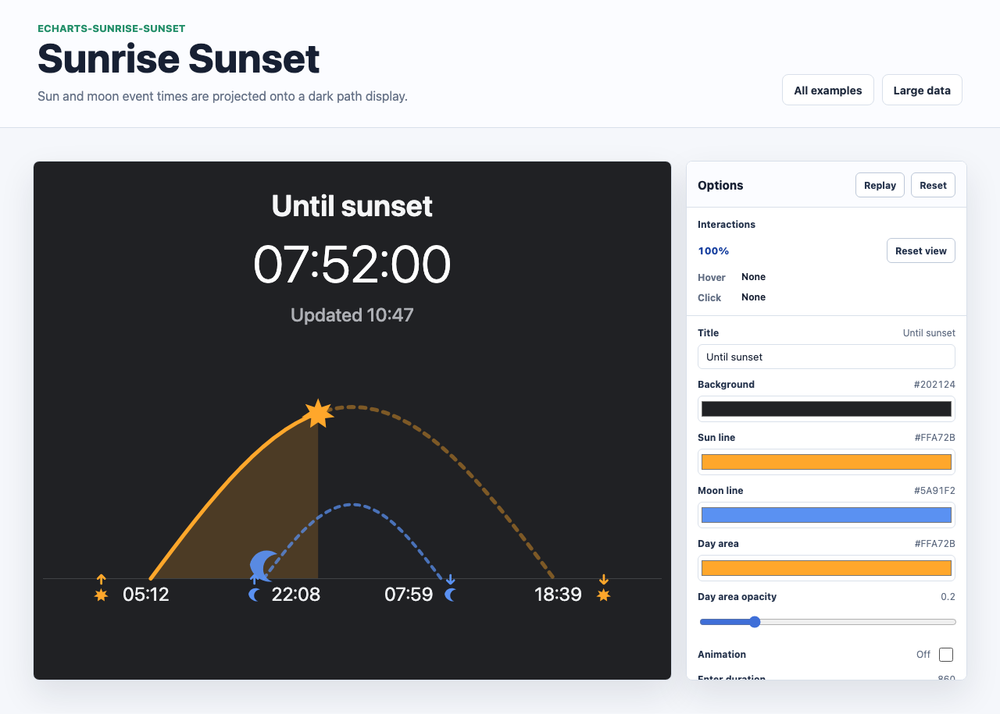

# @echarts-extension/sunrise-sunset

语言：[English](./README.md) | 中文

ECharts 日出、日落、月升和月落路径图扩展。导入本包即可注册 `series.type = 'sunriseSunset'`。



## 安装

```bash
npm install echarts @echarts-extension/sunrise-sunset
```

## 基础用法

```js
import * as echarts from 'echarts';
import '@echarts-extension/sunrise-sunset';

const chart = echarts.init(document.getElementById('main'));

chart.setOption({
  series: [
    {
      type: 'sunriseSunset',
      sunrise: '05:12',
      sunset: '18:39',
      moonrise: '22:08',
      moonset: '07:59',
      currentTime: '2026-05-05 10:47:33',
      title: 'Time until sunset',
      remainingText: '07:51:27',
      updatedText: 'Updated 10:46'
    }
  ]
});
```

## 数据

可以直接在 series 上传入值，也可以放在 `data` 中：

- `sunrise`、`sunset`、`moonrise`、`moonset`、`currentTime` 和 `updatedAt` 接受 `HH:mm`、本地日期时间字符串、时间戳或 `Date` 对象。
- 可提供 `title`、`remainingText` 和 `updatedText` 用于静态截图。
- 如果省略倒计时文本，布局会根据 `currentTime` 计算剩余时间。

## 常用选项

- `padding`, `baselineY`, `dayArcHeight`, `moonArcHeight`：几何设置。
- `moonStartRatio`, `moonEndRatio`：日弧内部的月弧锚点。
- `sunIcon`, `moonIcon`：可为 `path://...`、`image://...`、`false`，或包含 `path`、`image`、`size`、`offset` 和 `style` 的对象。
- `backgroundStyle`, `baselineStyle`, `dayLineStyle`, `moonLineStyle`, `dayAreaStyle`, `moonAreaStyle`：样式设置。
- `titleLabel`, `remainingLabel`, `updatedLabel`, `eventLabel`：文本设置。
- `enterAnimation`：控制太阳/月亮移动揭示动画。
