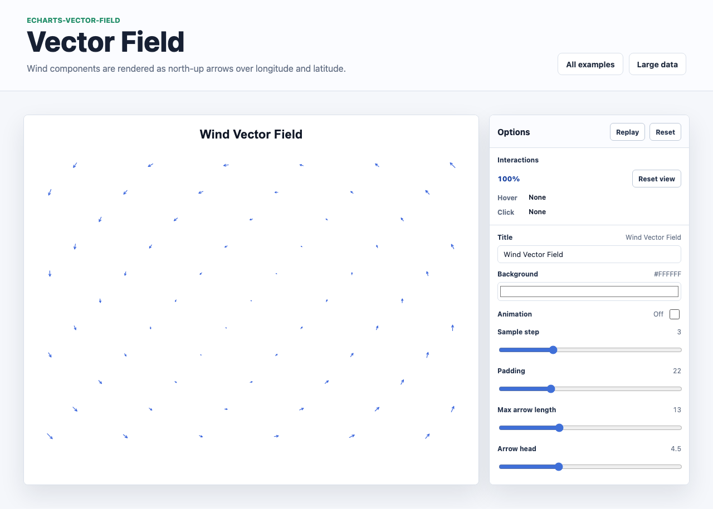

# @echarts-extension/vector-field

Language: English | [中文](./README_CN.md)

ECharts extension chart for vector field and wind data. Import this package for side effects to register `series.type = 'vectorField'`.



## Install

```bash
npm install echarts @echarts-extension/vector-field
```

## Basic Usage

```js
import * as echarts from 'echarts';
import '@echarts-extension/vector-field';

const chart = echarts.init(document.getElementById('main'));

chart.setOption({
  series: [
    {
      type: 'vectorField',
      data: [
        { longitude: 0.125, latitude: 45.125, u: -2.32, v: -2.07 },
        { longitude: 0.375, latitude: 45.125, u: -2.41, v: -2.15 },
        { longitude: 0.125, latitude: 45.375, u: -2.15, v: -1.88 }
      ],
      xField: 'longitude',
      yField: 'latitude',
      uField: 'u',
      vField: 'v',
      samplingStep: 1,
      maxLength: 18,
      lineStyle: {
        color: '#1d4ed8',
        width: 1.15,
        opacity: 0.88
      }
    }
  ]
});
```

## Data

Use objects or tuples:

- Object rows read `xField`, `yField`, `uField`, and `vField`.
- Defaults are `longitude`, `latitude`, `u`, and `v`.
- Tuple rows are `[x, y, u, v]`.
- Invalid rows without numeric coordinates or vectors are skipped.

## Useful Options

- `xExtent`, `yExtent`: explicit coordinate bounds.
- `invertY`: defaults to `true` for north-up coordinate rendering.
- `samplingStep`: render every nth vector for dense grids.
- `minLength`, `maxLength`, `lengthScale`: arrow length controls.
- `arrowHeadLength`, `arrowHeadAngle`: arrow head geometry.
- `lineStyle`, `emphasis`, `enterAnimation`: presentation controls.
