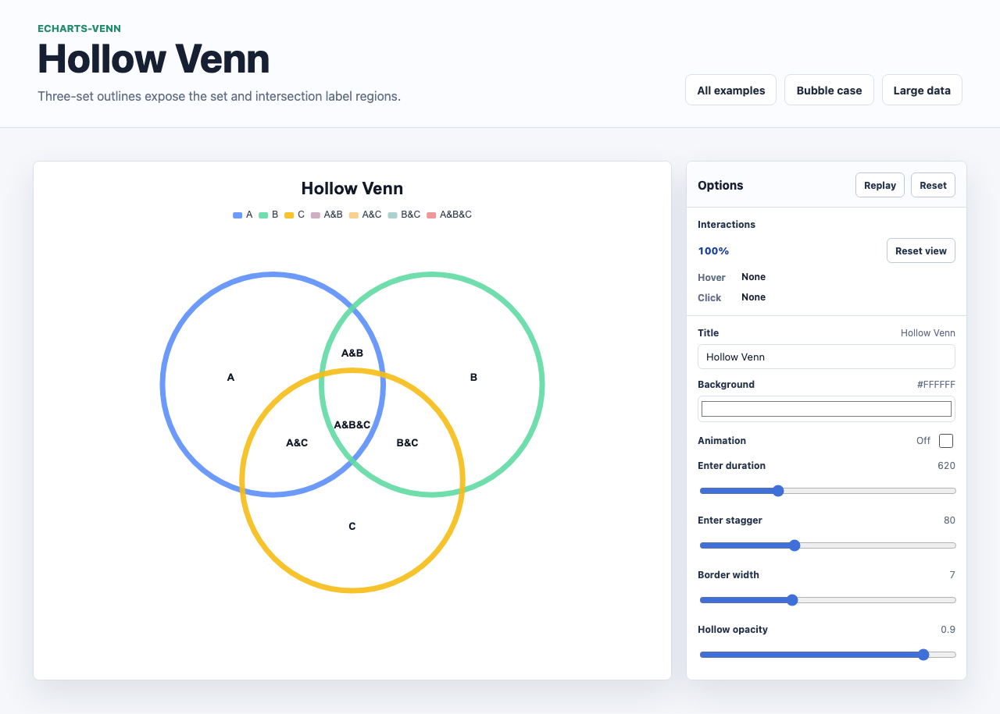

# @echarts-extension/venn

Language: English | [中文](./README_CN.md)

ECharts extension chart for hollow and bubble Venn diagrams. Import this package for side effects to register `series.type = 'venn'`.

| Hollow Venn | Bubble Venn |
| --- | --- |
|  |  |

## Install

```bash
npm install echarts @echarts-extension/venn
```

## Hollow Venn

```js
import * as echarts from 'echarts';
import '@echarts-extension/venn';

const chart = echarts.init(document.getElementById('main'));

chart.setOption({
  series: [
    {
      type: 'venn',
      layout: 'hollow',
      data: [
        { name: 'A', sets: ['A'], value: 100 },
        { name: 'B', sets: ['B'], value: 96 },
        { name: 'C', sets: ['C'], value: 82 },
        { name: 'A&B', sets: ['A', 'B'], value: 34 },
        { name: 'A&C', sets: ['A', 'C'], value: 24 },
        { name: 'B&C', sets: ['B', 'C'], value: 20 },
        { name: 'A&B&C', sets: ['A', 'B', 'C'], value: 12 }
      ],
      hollowStyle: { borderWidth: 6 },
      label: { show: true }
    }
  ]
});
```

## Bubble Venn

```js
chart.setOption({
  series: [
    {
      type: 'venn',
      layout: 'bubble',
      data: [
        { name: 'Radiohead', value: 100 },
        { name: 'Kanye West', value: 64 },
        { name: 'The Beatles', value: 58 },
        { name: 'Pink Floyd', value: 44 }
      ],
      itemStyle: { opacity: 0.6 },
      label: { show: true }
    }
  ]
});
```

## Data

- Hollow mode uses set rows with `sets`, such as `['A']`, `['A', 'B']`, or `['A', 'B', 'C']`.
- Bubble mode uses flat rows with `name` and `value`.
- `value` controls relative set or bubble size.

## Useful Options

- `layout`, `vennType`, or `mode`: `hollow` or `bubble`.
- `padding`, `minRadius`, `maxRadius`: layout bounds.
- `layoutOptions`: nested layout settings.
- `itemStyle`, `hollowStyle`, `label`, `emphasis`: presentation controls.
