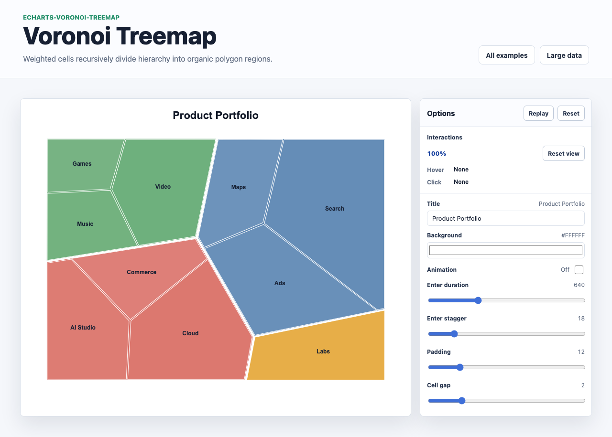

# @echarts-extension/voronoi-treemap

Language: English | [中文](./README_CN.md)

ECharts extension chart for weighted Voronoi treemaps. Import this package for side effects to register `series.type = 'voronoiTreemap'`.



## Install

```bash
npm install echarts @echarts-extension/voronoi-treemap
```

## Basic Usage

```js
import * as echarts from 'echarts';
import '@echarts-extension/voronoi-treemap';

const chart = echarts.init(document.getElementById('main'));

chart.setOption({
  series: [
    {
      type: 'voronoiTreemap',
      data: {
        name: 'Portfolio',
        children: [
          { name: 'Core', children: [{ name: 'Search', value: 48 }, { name: 'Ads', value: 32 }] },
          { name: 'Growth', children: [{ name: 'Cloud', value: 34 }, { name: 'AI', value: 26 }] }
        ]
      },
      gap: 2,
      maxIteration: 18,
      label: { show: true, showInternal: false }
    }
  ]
});
```

## Data

Use one root object, an array of roots, or array rows:

- Hierarchies use `children` by default.
- Flat array rows can use `dimensions`, `nameField`, and `valueField`.
- `childrenField`, `nameField`, and `valueField` support custom shapes.
- Set `rootVisible: false` to hide a synthetic root.

## Useful Options

- `padding` and `gap`: polygon spacing.
- `rootName`, `rootVisible`: root behavior.
- `sort`: `value`, `name`, `none`, `true`, or `false`.
- `maxIteration`: local Voronoi relaxation iteration count.
- `colors`, `itemStyle`, `label`, `emphasis`: presentation controls.
- Label formatter params include `name`, `value`, `percent`, `depth`, `isLeaf`, and `parentId`.
